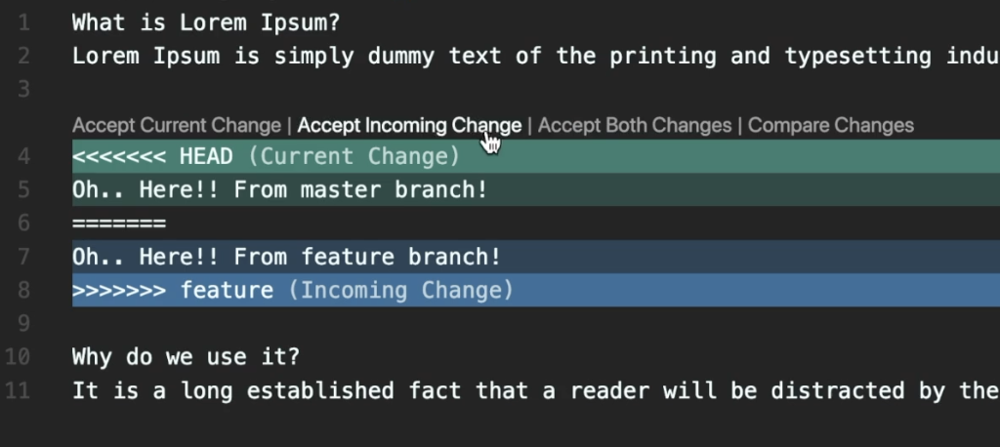

# [Git] 브런치 합치기 - merge

## `머지` 에 관한 모든 것 💭

- **머지의 기본 속성은 fast-forward 머지**
  - 깔끔하다
  - fast-forward 가 불가능한 경우, three-way merge(새로운 커밋 생성)으로 진행
- **머지한 뒤에는 항상 해당 브런치는 삭제**
  - 브런치의 존재 의미가 사라지고, 새로운 브런치를 작성하기 때문

<br/>

## 🚨 CONFLICT 🚨 발생했을 경우...

- 각 브런치에서 작업 후 이력을 합치기 위해 머지하다가 동일한 파일을 수정한 경우 발생
- 경고 : 자동으로 머지를 실패했고, 실패한 그 해당 파일을 언급

<br/>

### `수동으로 해결` 하려면...

- 실패한 해당 파일을 열어보면 아래와 같이 알 수 없는 문자열 생성

```
<<<<<<< HEAD
충돌한 문자1
=======
충돌한 문자2
>>>>>>> 브런치이름
```

- 필요한 문자만 남기고 나머지는 제거 후 저장
  - 해결할 부분만 수정해야지, 다른 건 건들지 말자!!!
- 상태 확인(status) 후 해당 파일 추가(add)
- `git merge --continue` 입력
  - 머지를 계속해보자는 뜻
  - 타이틀을 입력하고 저장하면 머지 완료

<br/>

### `머지툴` 사용하기

- `vscode` 를 사용하여 해당 파일 열기
  - 수동으로 할 때와 동일한 문자열
  - 위에 조그만한 버튼을 사용해 간편하게 해결



- 버튼은 순차적으로 설명
  - 현재 브런치의 내용을 선택 (초록줄, HEAD)
  - 다른 브런치의 내용을 선택 (파란줄, feature)
  - 둘 다 선택
  - 변경 내용을 간편하게 확인
- 상태 확인 후 `git merge --continue` 입력
