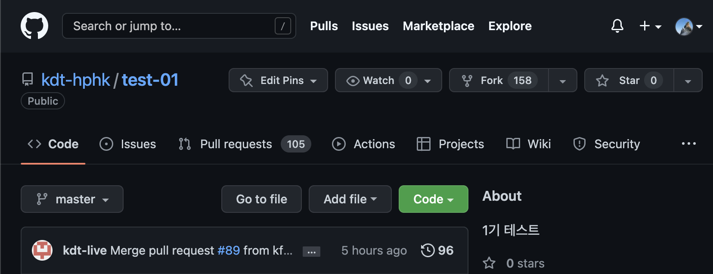
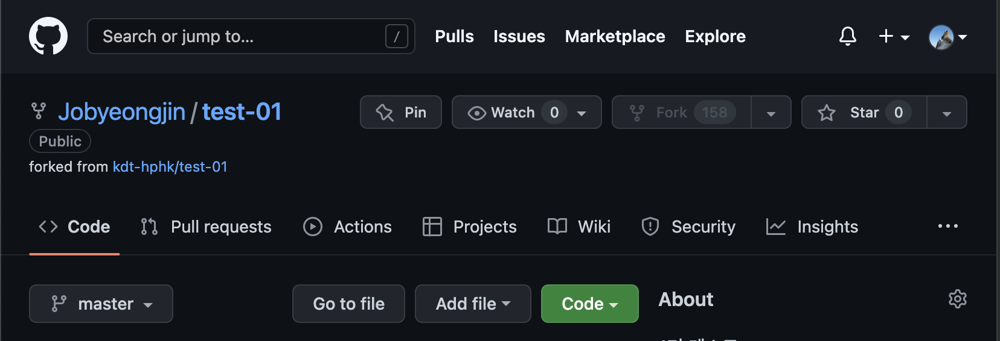

# [Git] 프로젝트에 기여하기

## 프로젝트에 참가하는 방법은 💭

<br />

1. 참여하고 싶은 프로젝트의 저장소에서 포크하기 (왼쪽 상단)
   

<br />

2. 포크 한 뒤에 저장소 위치 확인 (오른쪽 상단)
   

<br />

3. 본인 저장소에 있는 프로젝트 (🍴로 가져온) 주소 복사

<br />

4. 터미널 시작

```
git clone 복사한주소  🔸  프로젝트 가져오기
git checkout -b 브런치이름  🔸  브런치 생성 후 해당 브런치로 이동
🚨 git pull 저장소 브런치이름  🔸  작업하는 사이 누가 푸시했나 확인차 사용
git add 브런치이름(또는 모두)
git commit -m "메세지입력"
git push 저장소 브런치이름  🔸  저장소는 일반적으로 origin 그리고 브런치이름은 새 브런치이름인지 확인 🚨
```

<br />

5. 푸시하고 본인 계정 저장소으로 가면 `Compare&pull reqeust` 버튼 활성화
   - 노란 바탕에 초록 버튼
   - 메세지 작성 후 `Create pull request` 버튼 클릭

<br />

6. 원본 저장소에 머지가 완료되면 ?
   - 로컬과 동기화한 뒤 작업하던 로컬의 브런치는 삭제

```
git branch -d 브런치이름  🔸  브런치 삭제
```

<br />

> ## 참조

- 자세히 알고 싶다면 [클릭](https://git-scm.com/book/ko/v2/%EB%B6%84%EC%82%B0-%ED%99%98%EA%B2%BD%EC%97%90%EC%84%9C%EC%9D%98-Git-%ED%94%84%EB%A1%9C%EC%A0%9D%ED%8A%B8%EC%97%90-%EA%B8%B0%EC%97%AC%ED%95%98%EA%B8%B0)
- 협업이 궁금하다면 [클릭](https://inpa.tistory.com/entry/GIT-%E2%9A%A1%EF%B8%8F-%EA%B9%83%ED%97%99-%EC%9B%90%EA%B2%A9-%EC%A0%80%EC%9E%A5%EC%86%8C-%EA%B4%80%EB%A6%AC-git-remote)
