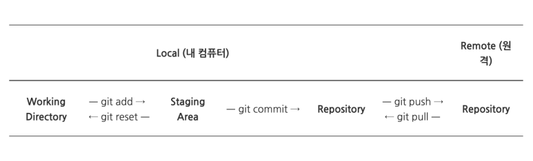

# [Git] Github 에 파일 올리기

🔸 설치시 가장 먼저해야 하는 일

- Github 사이트에 등록된 user name과 e-mail 주소 등록

```sh
git config --global user.name "이름입력"
git config --global user.email "이메일주소입력"
```



### git init

- 새로운 git 저장소(repository)를 생성할 때 사용하는 명령어
- 프로젝트 초기에 한 번 사용

### git add

- 커밋 이전의 대기(Staging Area) 상태로 전송

```sh
모든 파일 추가 🔸 git add .
특정 파일 추가 🔸 git add '파일이름'
```

### git commit

- 로컬저장소에 저장

```sh
git commit -m "메세지입력"
```

### git remote

- 레파지토리 셋팅
- github 사이트에서 해당 레파지토리 주소 복사 후 입력

```sh
git remote add origin 해당주소입력  🔸  origin 대신 remote 이름 사용 가능
```

### git push

- 원격저장소에 저장

```sh
git push
```
