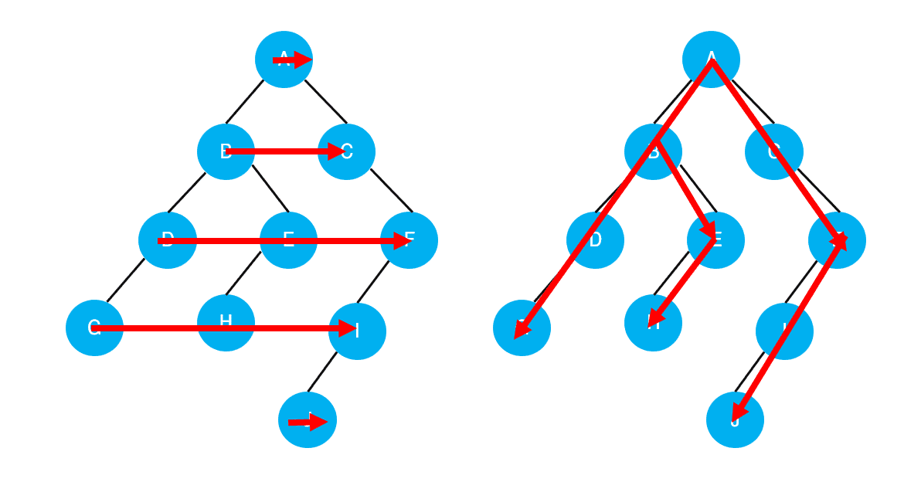

# [Algorithm] 깊이우선탐색 (DFS)

## **그래프 탐색 알고리즘**

- `깊이우선탐색` 과 `너비우선탐색` 이 있다
- `스택 + 그래프 + 큐`
- **깊이우선탐색(DFS) 그래프의 깊이를 우선**으로 탐색하기 위해 **스택의 개념을 활용**한다.
- **너비우선탐색(BFS) 그래프의 너비를 우선**으로 탐색하기 위해 **큐의 개념을 활용**한다.



---

<br />

## **깊이우선탐색 (DFS)**

> Depth-First Search, DFS

- **시작 정점으로부터 갈 수 있는 하위 정점까지 가장 깊게 탐색**하고, 더 이상 갈 곳이 없다면 마지막 갈림길로 돌아와서 다른 정점을 탐색하며 결국 모든 정점을 방문하는 순회 방법
- **미로 탈출**로 생각하면 이해하기 쉽다.
  - 어느 한 쪽 길로 가장 깊게 들어갔다가 막히면 다시 돌아와서 다른 길을 탐색한다.

<br />

### **깊이우선탐색의 특징** 💡

- **모든 정점을 방문할 때 유리**하다. 따라서 **경우의 수, 순열과 조합** 문제에서 많이 사용한다.
- 너비우선탬색(BFS)에 비해 코드 구현이 간단하다.
- 단, 모든 정점을 방문할 필요가 없거나 최단거리를 구하는 경우에는 너비우선탐색(BFS)이 유리하다.

<br />

### **DFS의 동작 과정** 💡

1. DFS를 하기 전에, 일단 **탐색을 진행할 그래프가 필요**하다.

   - 그래프는 `인접 행렬` 혹은 `인접 리스트` 방식으로 표현할 수 있다.
   - 인접 리스트가 활용하기 더 적합하다.

2. **각 정점을 방문했는지 여부를 판별**할 방문 체크 리스트가 필요하다.
   - 사람과 달리 컴퓨터는 각 정점에 방문했는지 여부를 알 수 없다. 따라서 `visited 리스트를 따로 선언` 하여 각 정점을 방문했는지 체크한다.

<br />

| 정점           | 0    | 1     | 2     | 3     | 4     | 5     | 6     |
| -------------- | ---- | ----- | ----- | ----- | ----- | ----- | ----- |
| **Visited[i]** | True | False | False | False | False | False | False |

- **인덱스는 각 정점의 번호**
- **방문한 정점은 True, 방문하지 않은 정점은 False**

<br />

```python
# visited = [False] * n (정점의 개수)

visited = [False, False, False, False, False, False, False]

# False -> 0
# True -> 1
```

<br />

#### **DFS의 사이클**

1. 현재 정점 방문처리
2. 인접한 모든 정점 확인
3. 방문하지 않은 인접 정점 이동

<br />

#### **반복문을 이용한 DFS**

- DFS는 직전에 방문한 정점으로 차례로 돌아가야 하므로, **후입선출(LIFO) 구조의 스택을 사용**한다.

<br />

```python
visited = [False] * n # 방문 처리 리스트

visited[start] = True # 시작 정점 방문 처리
stack = [start] # 돌아갈 곳을 기록

while stack: # 스택이 빌 때까지 반복 / 돌아갈 곳이 없을 때까지
  cur = stack.pop() # 현재 방문 정점 /후입선출

  for adj in graph[cur]: # 인접한 모든 정점에 대해
    if not visited[adj]: # 아직 방문하지 않았다면
      visited[adj] = True # 방문 처리
      stack.append(adj) # 스택에 넣기


'''
# cur가 0이라면
cur = 0

for adj in graph[cur]:  >>> 1, 2
    if not visited[adj]:  >>> 1
      visited[adj] = True  >>> 1
      stack.append(adj)  >>> 1
'''
```

<br />

### **DFS 문제 풀이** 📝

```python
# 백준 - 바이러스

n = int(input())
m = int(input())

graph = [[] for _ in range(n + 1)]
visited = [False] * (n + 1) # 문제 인덱스가 1부터 시작해서 + 1
total = 0

for _ in range(m):
  v1, v2 = map(int, input().split())
  graph[v1].append(v2)
  graph[v2].append(v1)

# DFS 코드
def dfs(start):
  stack = [start]
  visited[start] = True

  while stack:
    cur = stack.pop()

    for adj in graph[cur]:
      if not visited[adj]:
        visited[adj] = True
        stack.append(adj)
dfs(1) # 1번 정점부터 시작
```
