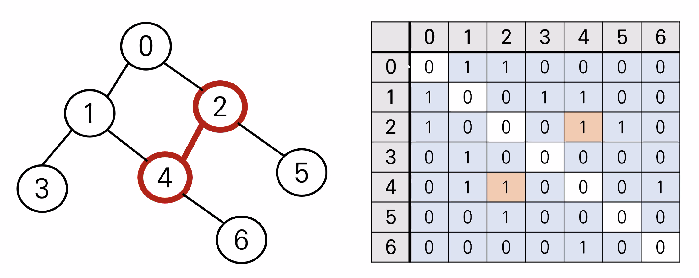

# [Algorithm] 그래프

## **그래프 (Graph)**

> **정점(Vertex or Node)과 이를 연결하는 간선(Edge)들의 집합** 으로 이루어진 비선형 자료구조
>
> 소셜 네트워크와 지하철 노선도 같이, **현실에 있는 개체 간의 관계**를 나타내기 위해 사용

<br />

### **그래프 관련 용어**

- `정점(Vertex)` : **간선으로 연결되는 객체**이며, 노드(Node)라고도 한다.
- `간선(Edge)` : 정점 간의 **관계(연결)를 표현하는 선**을 의미한다.
- `경로(Path)` : **시작 정점부터 도착 정점까지** 거치는 정점을 나열한 것을 의미한다.
- `인접(Adjacency)` : 두 개의 정점이 **하나의 간선으로 직접 연결된 상태**를 의미한다.

<br />

### **그래프의 종류**

1. **무방향 그래프(Undirected graph)**
   - 간선의 **방향이 없는** 가장 일반적인 그래프
   - 간선을 통해 양방향의 정점 이동 가능
   - `차수(Degree)` : 하나의 정점에 연결된 간선의 개수
   - `모든 정점의 차수의 합` = **간선 수 \* 2**

<br />

2. **유방향 그래프(Directed graph)**
   - 간선의 **방향이 있는** 그래프
   - 간선의 방향이 가리키는 정점으로 이동 가능
   - `차수(Degree)` : 진입 차수와 진출 차수로 나누어짐
     - `진입 차수(In-degree)` : 외부 정점에서 한 정점으로 **들어오는 간선의 수**
     - `진출 차수(Out-degree)` : 한 정점에서 외부 정점으로 **나가는 간선의 수**

<br />

### **그래프의 표현**

- **그림으로만 살펴보았던 그래프를 실제 문제에서 어떻게 코드로 표현할까?**
  - `딕셔너리`, `리스트` 사용
  - `노드를 key`로 사용, `인접한 노드를 value(리스트)`로 사용

<br />

```python
graph = {
  0: [1, 2],
  1: [0, 3, 4],
  2: [0, 4, 5],
  3: [1],
  4: [1, 2, 6],
  5: [2],
  6: [4]
}

subway = {
  'yeoksam': ['gangnam', 'seoleng'],
  'seoleng': ['역삼', '삼성', '선정릉', '한티']
}

# graph[0][0] -> 1

graph = [
  [1, 2],
  [0, 3, 4],
  [0, 4, 5],
  [1],
  [1, 2, 6],
  [2],
  [4]
]
# 인덱스로 접근
# graph[0][0] -> 1
```

<br />

#### **1. 인접 리스트(Adjacent list)**

- 리스트를 통해 각 **정점에 대한 인접 정점**들을 **순차적으로 표현**하는 방식
- `연결된 정점만 저장` 하여 효율적이므로 자주 사용된다.

```python
# 인접 리스트를 만드는 과정💡
n = 7
m = 7

graph = [[] * n for _ in range(n)]

for _ in range(m):
  v1, v2 = map(int, input().split())
  	graph[v1].append(v2)
    graph[v2].append(v1)

# 0 1이 들어왔다면
graph[0].append(1)
graph[1].append(0)
```

<br />

#### **2. 인접 행렬(Adjacent martix)**

- 두 정점을 연결하는 **간선이 없으면 0, 있으면 1**을 가지는 **행렬로 표현**하는 방식
- `직관적` 이고 만들기가 편하지만, `불필요한 공간이 낭비` 된다.



```python
# 인접 행렬을 만드는 과정💡
edges = [
  # [v1, v2]
  [0, 1],
  [0, 2],
  [1, 3],
  [1, 4],
  [2, 4],
  [2, 5],
  [4, 6]
]

n = 7

# n * n 행렬 초기화 [0 으로 초기화]
graph = [[0] * n for _ in range(n)]

for _ in range(m):
  v1, v2 = map(int, input().split())
  	graph[v1][v2] = 1
    graph[v2][v1] = 1


# print(*edges)
# flatten_edges = [0, 1, 0, 2, 1, 3, 1, 4, 2, 4, 4, 2, 5, 4, 6]
# set을 쓰면 유니크한 인자들을 찾을 수 있다!
```
