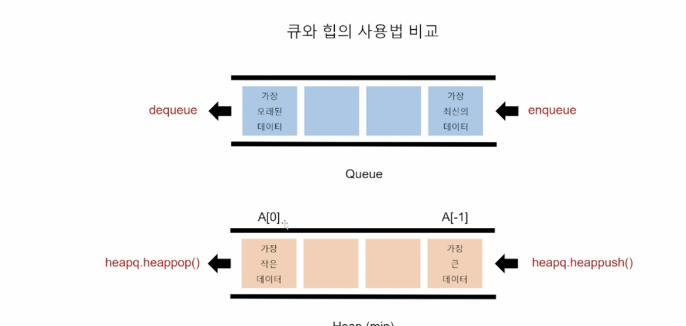

# [Algorithm] 힙(Heap)과 셋(Set)

<br />

## **힙 (Heap)**

> 우선순위 큐를 위하여 만들어진 자료구조
>
> 완전 이진 트리(Complete Binary Tree) 형태

- **완전 이진 트리(Complete Binary Tree) 란 ?**
  - 이진 트리에 노드를 `삽입할 때 왼쪽부터 차례대로 삽입` 하는 트리

<br />

### **힙을 알기 전에..**

- `일반적인 큐(Queue)` 는 순서를 기준으로 가장 먼저 들어온 데이터가 가장 먼저 나가므로 FIFO(First-in First-out, 선입선출) 방식

- 💡**순서가 아닌 다른 기준으로는 안될까?**

> Heap 이 필요한 경우!!

- 우선순위 큐(Priority Queue) 는 `우선순위(중요도, 크기 등 순서 이외의 기준) 를 기준` 으로 가장 우선순위가 높은 데이터가 가장 먼저 나가는 방식
- **순서가 아닌 우선순위를 기준으로 가져올 요소를 결정하는 큐**
  - 가중치가 있는 데이터
  - 작업 스케줄링
  - 네트워크

<br />

### **큐와 힙의 사용법 비교**



<br />

### **우선순위 큐를 구현하는 방법**

1. 배열(Array)
2. 연결 리스트(Linked List)
3. 힙(Heap)

<br />

### **우선순위 큐 구현별 시간 복잡도**

| 연산 종류                | Enqueue(추가) | Dequeue     |
| ------------------------ | ------------- | ----------- |
| 배열(Array)              | O(1)          | O(N)        |
| 정렬된 배열              | O(N)          | O(1)        |
| 연결 리스트(Linked List) | O(1)          | O(N)        |
| 정렬된 연결 리스트       | O(N)          | O(1)        |
| **힙(Heap)**             | **O(logN)**   | **O(logN)** |

<br />

### **힙(Heap)의 특징**

- **최대값 또는 최소값을 빠르게 찾아내도록 만들어진 데이터 구조**
- 완전 이진 트리의 형태로 **느슨한 정렬 상태를 지속적으로 유지**
- 힙 트리에서는 **중복 값을 허용**

<br />

### **힙(Heap)은 언제 사용해야 할까?**

1. 데이터가 `지속적으로 정렬` 되야 하는 경우
2. 데이터에 `삽입 / 삭제가 빈번` 할 때

<br />

### **파이썬의 heapq 모듈**

- `Minheap(최소 힙) 으로 구현` 되어 있음
  - 가장 작은 값이 먼저 옴
- 삽입, 삭제, 수정, 조회 **연산의 속도가 리스트보다 빠르다**
- 배열, 연결 리스트, 힙으로 구현 가능

<br />

### **딕셔너리 메소드**

1. **heapq.heapify()**

```python
import heapq

numbers = [5, 3, 2, 4, 1] # 정렬되지 않은 데이터

heapq.heapify(numbers) # 원본을 바꾼다!!

print(numbers) # 1 3 2 4 5, 느슨한 정렬

```

<br />

2. **Heaps.heappop(heap)**

```python
import heapq

numbers = [5, 3, 2, 4, 1] # 정렬되지 않은 데이터

heapq.heapify(numbers) # 원본을 바꾼다!!

heapq.heappop(numbers) # 맨 앞의 최소값만 빼면..

print(numbers) # 2 3 5 4!!! 최소값인 2가 앞으로!!!
```

<br />

3. **Heaps.heappush(heap, item)**

```python
import heapq

numbers = [5, 3, 2, 4, 1] # 정렬되지 않은 데이터

heapq.heapify(numbers) # 원본을 바꾼다!!

heapq.heappop(numbers) # 맨 앞의 최소값만 빼면..

heapq.heappop(numbers)

heapq.heappush(numbers, 10) # 느슨하게 넣어주기

heapq.heappush(numbers, 0)

print(numbers) # 0 3 5 10 4

```

<br />

### **문제 풀이**

- 백준 - 최소 힙

```python
import heapq

n = int(input())
heap = []

for _ in range(n):
    number = int(input())

    if number != 0:
        heapq.heappush(heap, number)
    else:
        if not heap:
            print(0)
        else:
            print(heapq.heappop(heap))
```

---

<br />

## **셋 (Set)**

> 셋(Set)은 수학에서의 '집합' 을 나타내는 데이터 구조

<br />

### **셋(Set) 의 연산**

1. `.add()`
2. `.remove()`
3. `+` (합집합)
4. `-` (차집합)
5. `&` (교집합)
6. `^` (대칭 차집합)

<br />

### **셋(Set) 은 언제 사용해야 할까?**

1. 데이터의 `중복이 없어야` 할 때 (고유값들로 이루어진 데이터가 필요할 때)
2. 정수가 아닌 데이터의 `삽입, 삭제, 탐색이 빈번히 필요` 할 때

<br />

### **셋(Set) 연산의 시간 복잡도**

| 연산 종류   | 시간 복잡도 |
| ----------- | ----------- |
| 탐색        | O(1)        |
| 제거        | O(1)        |
| 합집합      | O(N)        |
| 교집합      | O(N)        |
| 차집합      | O(N)        |
| 대칭 차집합 | O(N)        |

<br />

### **문제 풀이**

- 백준 - 문자열 집합

```python
s = ['baekjoon', 'codeplus', '....']

words = [
  'baekjoon', 'codeplus', 'codeminus', '....'
]

# 풀이 - 1
cnt = 0
for word in words:
  	if word in s:
   	# if word in set(s): , 속도 차이도 비교하면서 문제 풀기!!
    # 반복문 안에 set()을 써도 되는건가? 밖에다 변수를 설정해야 하는 게 아닌가?💡
      	cnt += 1

print(cnt)


# 풀이 - 2
print(len(set(words) & set(s)))
```
