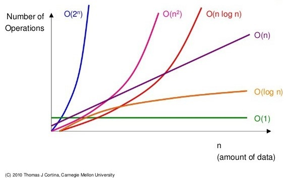

# [Algorithm] 시간 복잡도

## **시간복잡도**

> 문제를 해결하는데 걸리는 시간과 입력의 함수 관계를 가리킨다

<br />

- **단순하게 `알고리즘의 수행 시간` 을 의미**

  - 시간 복잡도가 높다 => 느린 알고리즘
  - 시간 복잡도가 낮다 => 빠른 알고리즘

<br />

- **시간 복잡도에 따라 알고리즘 성능 비교**

  - count(), `6n + 4` (선형 증가) => O(n)
  - count(), `3n + 2` (선형 증가) => O(n)
  - count(), `3n2 + 6n + 1` (제곱으로 증가) => O(n2)

<br />

- **기본연산의 총 횟수 == 알고리즘의 소요 시간**

---

<br />

## **빅오(Big-O) 표기법**

> 입력 n이 `무한대` 로 커진다고 가정하고 시간 복잡도를 간단하게 표시하는 것

<br />

- **`최고차항` 만 남기고 계수와 상수 제거**

- **다양한 시간 복잡도 종류 살펴보기**



| 표기       | 내용                                                                                            | 1초가 걸리는 입력의 크기(1억 기준) |
| ---------- | ----------------------------------------------------------------------------------------------- | ---------------------------------- |
| O(1)       | 단순 산술 계산 (덧셈, 뺄셈, 곱셉, 나눗셈) <br />a + b, 100 \* 200                               | 1억                                |
| O(log N)   | 크기 N인 리스트를 반절씩 순회 / 탐색<br />이진탐색 (Binary Search), 분할정복 (Divide & Conquer) | 500만                              |
| O(N)       | 크기 N인 리스트를 순회<br />1중 for 문                                                          | -                                  |
| O(N log N) | 크기 N인 리스트를 반절씩 탐색 \* 순회<br />높은 성능의 정렬 (Merge / Quick / Heap Sort)         | -                                  |
| O(N^2)     | 크기 M, N인 2중 리스트를 순회 <br />2중 for 문                                                  | 1만                                |
| O(N^3)     | 3중 리스트를 순회<br />3중 for 문                                                               | 500                                |
| O(2^N)     | 크기 N 집합의 부분 집합                                                                         | 20                                 |
| O(N!)      | 크기 N 리스트의 순열                                                                            | 10                                 |

<br />

### **가우스의 합 공식 💡**

- 내장 함수, 메서드의 시간 복잡도도 확인할 필요가 있다 💡

```python
# 1부터 n까지 일일이 더하기

# 1중 for 문 사용
def get_total(n):
  total = 0
 	for i in range(1, n + 1):
    total += 1
  return total

print(get_total(10))
>>> 55

print(get_total(1000000000))
>>> 제한 시간 1초 초과


# 가우스의 합 공식 사용
def get_total(n):
	return (n * (n + 1)) // 2

print(get_total(10))
>>> 55

print(get_total(1000000000))
>>> 500000000500000000
```

---

<br />

## **리스트**

> 파이썬은 배열의 장점과 연결 리스트의 장점을 모두 가지고 있다

<br />

### **배열(Array)**

> 여러 데이터들이 연속된 메모리 공간에 저장되어 있는 자료구조

- `인덱스` 를 통해 데이터에 빠르게 접근
- 배열의 길이는 변경 불가능 => 길이를 변경하고 싶다면 새로 생성
- 데이터 타입은 고정

<br />

### **연결 리스트 (Linked List)**

> 데이터가 담긴 여러 노드들이 순차적으로 연결된 형태의 자료구조

- 맨 처음 노드부터 순차적으로 탐색
- 연결리스트의 `길이 자유롭게` 변경 가능 => `삽입, 삭제가 편리`
- `다양한 데이터 타입` 저장
- 데이터가 메모리에 연속적으로 저장되지 않음

<br />

### **파이썬 리스트의 메소드**

| 메소드      | 설명                                              | 표기       |
| ----------- | ------------------------------------------------- | ---------- |
| .append()   | 리스트 맨 끝에 새로운 원소 `삽입`                 | O(1)       |
| .pop()      | 특정 인덱스에 있는 원소를 `삭제 및 반환`          | O(1)       |
| .count()    | 리스트에서 행당 원소의 `개수` 를 반환             | O(n)       |
| .index()    | 리스트에서 처음으로 원소가 등장하는 `인덱스` 반환 | O(n)       |
| .sort()     | 리스트를 오름차순으로 `정렬`                      | O(n log n) |
| .reverse()  | 리스트를 원소들의 순서를 `거꾸로 뒤집기`          | O(n)       |
| .len()      | 리스트 `길이(원소의 개수)` 를 반환                | O(1)       |
| .sum()      | 리스트의 모든 원소의 `합` 을 반환                 | O(n)       |
| .max()      | 리스트의 원소 중 `최대값` 을 반환                 | O(n)       |
| .min()      | 리스트의 원소 중 `최소값` 을 반환                 | O(n)       |
| .sorted()   | 오름차순으로 `정렬된 새로운 리스트` 반환          | O(n log n) |
| .reversed() | 리스트의 순서를 `거꾸로 뒤집은 새로운 객체` 반환  | O(n)       |

---

<br />

#### 📚 참조

- 파이썬 연산자의 시간복잡도가 궁금하다면 [클릭](https://wiki.python.org/moin/TimeComplexity)
- 정리된 블로거가 궁금하다면 [클릭](https://dev.plusblog.co.kr/42) [/ 클릭](https://velog.io/@ggyungjun0913/%ED%8C%8C%EC%9D%B4%EC%8D%AC-%EB%82%B4%EC%9E%A5%ED%95%A8%EC%88%98-%EC%8B%9C%EA%B0%84-%EB%B3%B5%EC%9E%A1%EB%8F%84)
