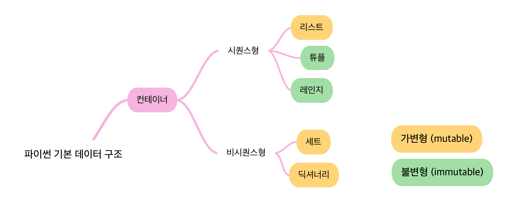
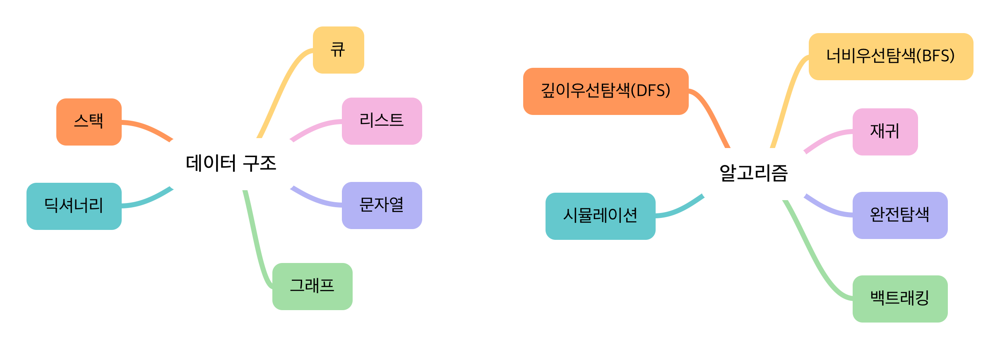

# 알고리즘 & 코딩테스트

## **알고리즘이란 💡**

> 어떤 문제를 해결하기 위해 정해진 일련의 절차나 행동

- 문제란 Iinput을 넣었을 때, 원하는 Output이 나오도록 하는 것

<br />

---

## **코딩테스트란 💡**

> 기업에서 지원자를 대상으로 코딩을 통한 알고리즘 기반 문제 해결 능력을 테스트 하는 것

- `문제 의도를 정확히 파악` 하고, 적절한 `해결 방법을 적용` 할 수 있는가?
- 해결 방법을 프로그래밍을 통해 `능숙하게 구현` 할 수 있는가?
- 실제 현업 환경과 달리 객체 지향적으로 코드를 작성하지 않으므로 완벽하게 현업 능력을 평가할 수는 없지만, 신입의 실력을 측정하는데는 적절하다.

<br />

### **종류**

- **온라인**
  - `문제 풀이 사이트`
  - 코딩테스트 팁💡
    - 사전에 `연습장` 과 `필기도구` 준비
    - 테스트 케이스 이외의 `엣지 케이스` 도 확인
    - 인터넷, IDE, 알고리즘 `노트 적극 활용`
- **오프라인**
  - `개발형 코딩테스트`
    - 언어 및 개발 환경의 제약이 없음
    - JSON format의 데이터를 응갑하는 REST API를 활용
  - `화이트보드 손코딩`
    - 어떤 방식으로 문제를 해결하는지 `논리, 과정, 커뮤니케이션 스킬` 을 평가
- **기업별**
  - 기업별 분석 자료
    - GitHub 검색

<br />

### **준비하기**

> 가장 의미있는 데이터는 많이 풀어야 한다

- **대표 문제 풀이 사이트**

  | 문제 풀이 사이트 | 특징                                                               |
  | ---------------- | ------------------------------------------------------------------ |
  | 백준             | 가장 많이 사용<br />최다 문제 보유<br />유형별 단계별 문제 제공    |
  | 프로그래머스     | 실제 코딩테스트 환경과 유사<br />카카오 기출 문제 제공             |
  | 코드             | 파이썬 기초 100제                                                  |
  | SWEA             | 삼성전자에서 제작한 플랫폼<br />삼성 SW 역량 테스트 문제 다수 보유 |

<br />

- **문제는 매번 풀 때마다 다른 유형을 푸는 것이 좋다?**
  - `X`
  - 문제는 같은 유형 문제를 `단기간에 여러 번 반복` 하는 것이 좋고, 코딩테스트 직전에는 모의고사처럼 시간 제한을 두고 여러 유형을 푸는 것이 좋다.

<br />

- **오랜 시간 고민했는데 풀리지 않을 때, 끝까지 답을 보지 않는 것이 좋다?**
  - `X`
  - 다만, 이후에 답을 보지 않고 반드시 `한번 더 풀어서 내 것` 으로 만들어야 한다. 최대한 타인의 답을 많이 보면서 여러 풀이를 습득하는 것이 좋다.

<br />

- **알고리즘 문제는 몇 문제 정도 풀어야 할까?**
  - `약 300 ~ 350 문제`
  - 사람마다 다르지만, 통계적으로 이 정도 풀면 대부분의 코딩테스트에 무난하게 합격할 수 있다.

<br />

- **기타 꿀팁 💡**
  - `변수명` 대충 짓지 않기
  - 언어가 가지는 `내장 함수, 라이브러리` 를 적극 활용하기
  - 반복되는 코드는 `함수화를 통해 가독성 있게` 작성하기
  - 면접을 위해 풀이를 남에게 `설명` 하는 연습 반드시 필요

<br />

---

## **데이터 구조 & 알고리즘**

> 프로그램 = 데이터 구조 + 알고리즘

<br />

### **데이터 구조**

> 데이터를 다양한 방식으로 저장하고 조회, 삽입, 변경, 삭제와 같은 조작 기능을 제공

- **왜 중요할까 ?**
  - `물통 == 물 + 통`
    - 아무데나 담을 수 없다
    - 문제 상황에 따라 더 적합한 통이 필요하다
    - 데이터를 `필요에 따라 저장하고 활용` 할 수 있으므로 `문제를 더 효율적으로 풀기 위한 도구` 가 된다

<br />

- **구조를 안다는 것**
  - 어떻게 `저장` 하고 어떻게 `활용(조작)` 할 수 있는지
  - 도구의 특성을 알아야 제대로 활용을 할 수 있다

<br />

- **파이썬 기본 데이터 구조**



<br />

- **데이터 구조와 알고리즘**



<br />

---

## **입력 & 출력**

> 알고리즘의 핵심은 특정한 인풋에 따라 원하는 아웃풋을 내기 위한 것이기 때문에 가장 기초적이면서도 중요하다

<br />

### **입력 활용 예시**

> Input()

- `사용자의 입력` 한 줄을 `문자열` 로 받는 함수

```python
word = input()
>>> happyhacking
# 결과값은 'happyhacking'
```

- `map()` 함수

```python
# 문자열로 입력
a = input()

# 한 개 숫자로 입력
b = int(input())
c = float(input())

# 여러 개 숫자로 입력
d, e = map(int, input().split())
f, g, h = map(float, input().split())
```

<br />

### 출력 활용 예시

> print()

- `데이터를 출력` 할 수 있는 함수
- 자동적으로 `줄 바꿈` 발생

```python
print('happy')
print('hacking')
>>> happy
>>> hacking

# 콤마를 사용하면 공백으로 출력
print(a, b)
>>> happy hacking
```

- `end`, `sep` 옵션을 사용하여 출력 조작하기

```python
a = 'happy'
b = 'hacking'

# 다 출력되고 마지막에 @
print(a, end='@')
print(b)
>>> happy@hacking

# 구분자, 문자 사이에 개행 \n
print(a, b, sep='\n')
>>> happy
>>> hacking
```
