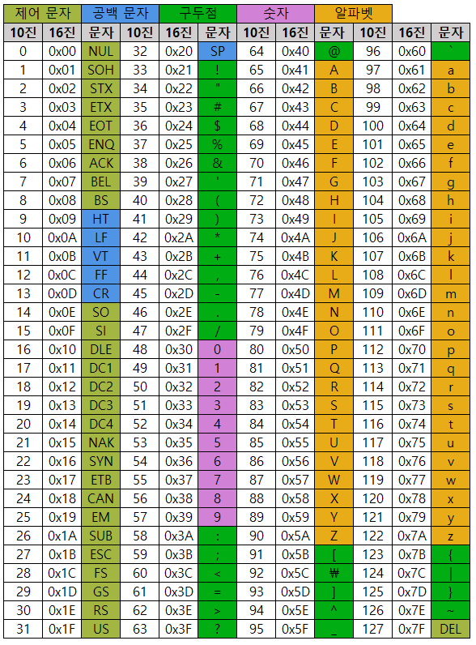

# [ASCII] 아스키 코드란 ?

## **아스키 코드는...**

- 미국 국립 표준 협회에서 표준화한 정보교환용 7비트 부호체계로서, 영문 알파벳을 사용하는 대표적인 `문자 인코딩`이다.
  - 인코딩이란 사용자가 입력한 문자나 기호들을 컴퓨터가 이용할 수 있는 신호로 만든 것
  - 복잡한 신호를 `0과 1의 디지털 신호(2진수)로 변환`하는 것을 의미함
- 현대에서는 유니코드를 더 많이 사용
- 출력 가능한 문자들은 52개의 영문 `알파벳 대소문자(a ~ Z)`, 10개의 `숫자(0 ~ 9)`, 32개의 `특수 문자`와 `공백`(null) 구성

 

## **아스키 표**

