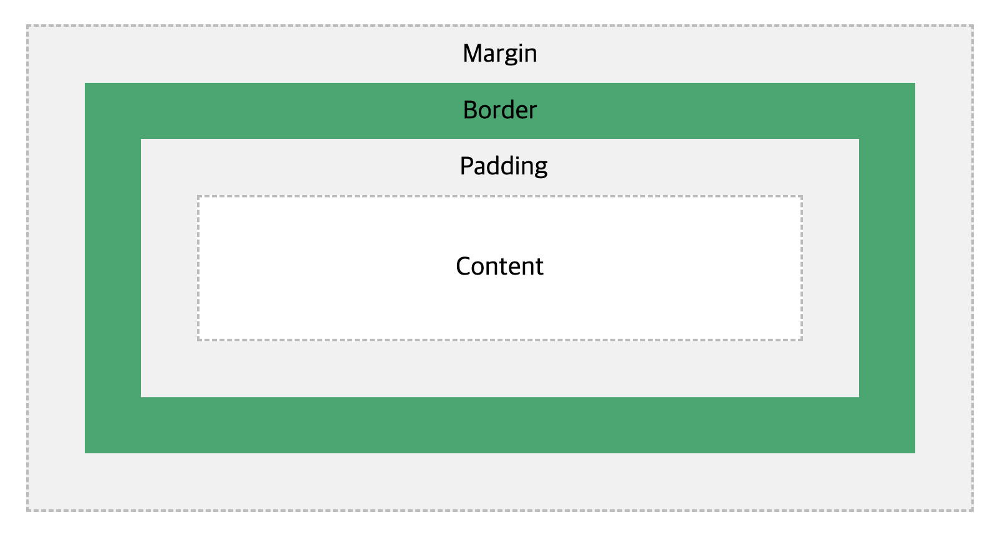

# [CSS] CSS 기초 📝

## **CSS란 💭**

> Cascading Style Sheets, 스타일을 지정하기 위한 언어

- CSS 구문은 선택자를 통해 스타일을 지정할 HTML 요소를 선택

- 중괄호 안에서는 속성과 값, 하나의 쌍으로 이루어진 선언을 진행

- 각 쌍은 선택한 요소의 속성, 속성에 부여할 값을 의미

  - 속성(Property) : 어떤 스타일 기능을 변경할지 결정
  - 값(Value) : 어떻게 스타일 기능을 변경할지 결정

```css
div {
  color: red;
}
Selector(선택자) {
  Property(속성): Value(값);
}
/* Declaration(선언) */
```

<br />

## **CSS 기초 선택자 💭**

| 선택자        | 설명                                                                                                                                                        | 비고 |
| ------------- | ----------------------------------------------------------------------------------------------------------------------------------------------------------- | ---- |
| 요소(element) | HTML 태그를 직접 선택                                                                                                                                       |      |
| 클래스(class) | 마침표(.) 문자로 시작하며, 해당 클래스가 적용된 항목을 선택                                                                                                 |      |
| 아이디(id)    | # 문자로 시작하며, 해당 아이디가 적용된 항목을 선택<br />일반적으로 하나의 문서에 1번만 사용<br />여러 번 사용해도 동작하지만, 단일 id를 사용하는 것을 권장 |      |

```
CSS는 선택해서 스타일을 적용한다.
적용에는 우선순위가 있다.
같은 레벨이라면 나중에 '선언'된 것이 적용된다.
id, class, 태그는 서로 다른 레벨이다.
(id > class > 태그순)

다만, 일반적으로 CSS 스타일링은 클래스로만 한다.

id는 문서에서 반드시 한번만 등장해야 한다.
id는 잘 활용하지 않고, 자바스크립트(JS)로 개발할 때 보통 활용합니다.
```

<br />

### **부모 자식 선택자**

```css
ul li {
  color: tomato;
}
ul > li {
  color: red;
}
ul,
ol {
  color: blue;
}
ul.classname {
  color: black;
}
```

- `A B` : A 밑에 B 전부
- `A>B `: 바로 밑에 B만
- `A, B` : A 와 B
- `A.B` : A 중에 B class만

<br />

### **가상 클래스 선택자(pseudo class selector)**

> 선택자 뒤에 가상 이벤트를 붙이면 특정 이벤트마다 적용할 스타일을 설정할 수 있습니다.

```css
선택자:가상클래스 {
  속성: 값;
}
```

| 선택자        | 설명                         |
| ------------- | ---------------------------- |
| :link         | 방문하지 않은 링크           |
| :visited      | 방문한 적 있는 링크          |
| :hover        | 마우스 커서를 올렸을 때      |
| :active       | 마우스 클릭했을 때           |
| :focus        | 입력창 또는 탭키를 눌렀을 때 |
| :first-child  | 첫번째 자식 요소             |
| :last-child   | 마지막 자식 요소             |
| :nth-child(n) | n번째 자식 요소              |

<br />

## **선택자 우선순위 💭**

1. `Important` : !important를 부여 받은 선택자
2. `inline style` : 스타일을 정의
3. `id` : 아이디 선택자
4. `Class` : 클래스 선택자
5. `tag` : 태그 선택자
6. `\*` : 전체 선택자

<br />

---

# [CSS] CSS 기본 스타일 📝

## **크기 단위 💭**

| 단위 | 설명                                                                                                      |
| ---- | --------------------------------------------------------------------------------------------------------- |
| px   | - 모니터 해상도의 한 화소인 픽셀 기준<br />- 픽셀의 크기는 변하지 않기 때문에 고정적인 단위               |
| %    | - 백분율 단위<br />- 가변적인 레이아웃에서 자주 사용                                                      |
| em   | - (바로 위, 부모 요소) 상속의 영향을 받음<br />- 배수 단위, 요소에 지정된 사이즈에 상대적인 사이즈를 가짐 |
| rem  | - 상속의 영향을 받지 않음<br />- 최상위 요소(html)의 사이즈를 기준으로 배수 단위를 가짐                   |

<br />

## **색상 단위 💭**

- `색상 키워드`

  - red;, black;, ..

- `RGB 색상`

  - '#' + 16진수 표기법 : #000; 또는 #000000;

    rgb() 함수형 표기법 : rgb(red, green, black);

- `HSL 색상` : 색상, 채도, 명도

  - hsla(120, 100%, 0.5);

- `a는 alpha(투명도)`

<br />

## **Box model 💭**



| 명칭    | 설명                      |
| ------- | ------------------------- |
| content | 실제 내용이 위치하는 영역 |
| padding | 테두리 안쪽 영역          |
| border  | 테두리 영역               |
| margin  | 테두리 바깥 영역          |
|         |                           |

<br />

## **CSS Display 💭**

| 속성   | 설명                                                                                                                                                              |
| ------ | ----------------------------------------------------------------------------------------------------------------------------------------------------------------- |
| block  | - 줄바꿈이 일어나는 요소<br />- 화면 크기 전체의 가로 폭을 차지<br />- 블록 레벨 요소 안에 인라인 레벨 요소가 들어갈 수 있음                                      |
| inline | - 줄바꿈이 일어나지 않는 행의 일부 요소<br />- 컨텐츠 너비만큼의 가로 폭을 차지<br />- 너비, 높이, 마진을 지정할 수 없음<br />- 상하 여백은 line-height 으로 지정 |
|        |                                                                                                                                                                   |
