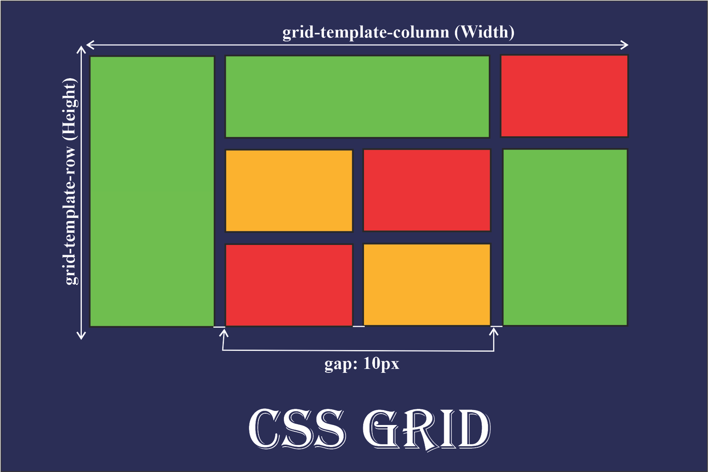
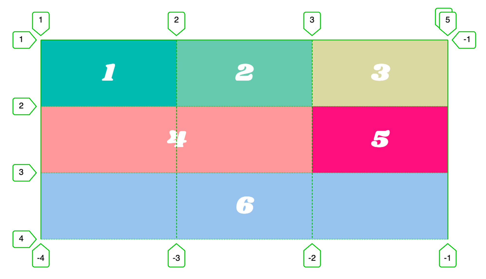

# Grid

[CSS Grid 사용 가이드](https://yamoo9.gitbook.io/css-grid/css-grid-guide)

## 핵심

- 그리드는 행(row)과 열(column)로 이루어져 플랙스보다 자유로운 배치가 가능하다.



## 사용해보기

```css
.grid {
  display: grid;
  grid-template-columns: 10px 10px 10px;
  grid-template-rows: 10px 20px 10px;
  gap: 10px;
}
```

- 행과 열의 크기를 지정한다. 각각의 아이템마다 크기를 지정할 수 있다.
- 크기를 지정할 때는 단위로는 `px(픽셀), %(퍼센트), fr(분수)`을 사용한다.

[fr 단위](https://blog.sonim1.com/198)

- 똑같은 크기를 지정하는 게 번거롭다면 repeat(반복횟수, 크기) 함수를 사용할 수 있다.

```css
.grid {
  display: grid;
  grid-template-columns: repeat(3, 10px);
}
```

## 그리드 병합

병합하고 싶은 아이템에 클래스를 지정 후 `그리드 포인트(start, end)를 지정`함으로써 그리드의 병합이 가능하다.



```css
.grid {
  display: grid;
  grid-template-columns: repeat(3, 10px);
  grid-template-rows: repeat(3, 10px);
}

.item4 {
  grid-column-start: 1;
  grid-column-end: 3;
  grid-row-end: 2;
  grid-column-end: 3;
}

.item6 {
  grid-column-start: 1;
  grid-column-end: -1;
  grid-row-end: 3;
  grid-column-end: 4;
}
```

- start, end를 작성하기 번거롭다면 줄여서 작성할 수 있다.

```css
.grid {
  display: grid;
  grid-template-columns: repeat(3, 10px);
  grid-template-rows: repeat(3, 10px);
}

.item4 {
  grid-column: 1 / 3;
  grid-row: 2 / 3;
  /* 혹은 span을 사용하여 1번줄부터 2칸을 차치할 거라고 명시할 수 있다. */
  grid-column: 1 / span 2;
}

.item6 {
  grid-column: 1 / -1;
  grid-row: 3 / 4;
}
```

## Grid Area

병합하고 싶은 아이템에 클래스 지정 후 영역을 설정할 수 있다.


```css
.grid {
  grid-template-areas:
    'a b c'
    'd d e'
    'f f f';
}
.item1 {
  grid-area: a;
}
.item2 {
  grid-area: b;
}
.item3 {
  grid-area: c;
}
.item4 {
  grid-area: d;
}
.item5 {
  grid-area: e;
}
.item6 {
  grid-area: f;
}
```
