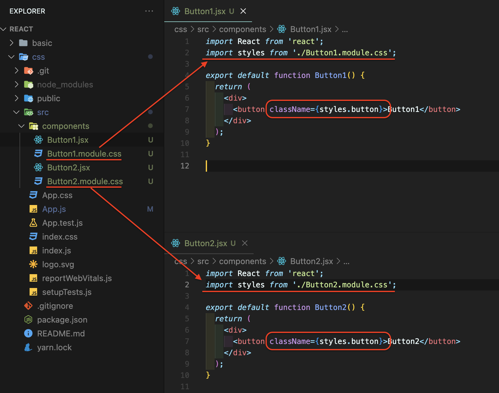

# CSS library

## 1. PostCSS 👍

_CSS Module_

- 순수 CSS 모듈화

[PostCSS](https://postcss.org/)

1. 기존 `CSS 파일이름에 module 추가`
2. `import 뒤에 파일명 작성`
3. 클래스 이름 작성시 `파일명 + 클래스명`

 

## 2. Styled Components

_CSS in JavaScript_

- 자바스크립트에서 작성한 코드를 CSS 파일로 만드는 과정 때문에 성능에 좋지 않음

[styled-components](https://styled-components.com/)

 

## 3. TailwindCSS 👍

_Bootstrap CSS_

- 미리 정해진 클래스 이름들을 사용

[Tailwind CSS - Rapidly build modern websites without ever leaving your HTML.](https://tailwindcss.com/)
