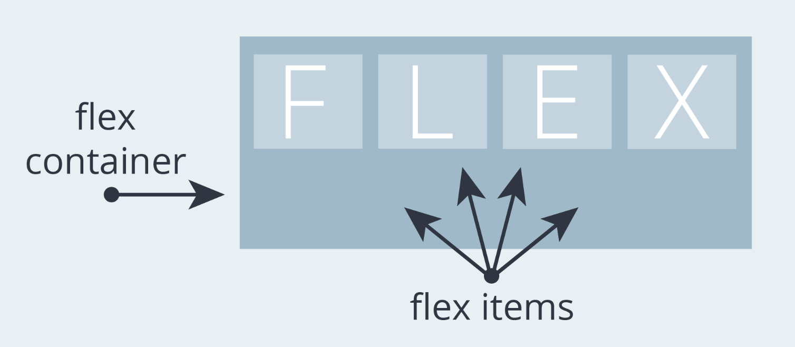
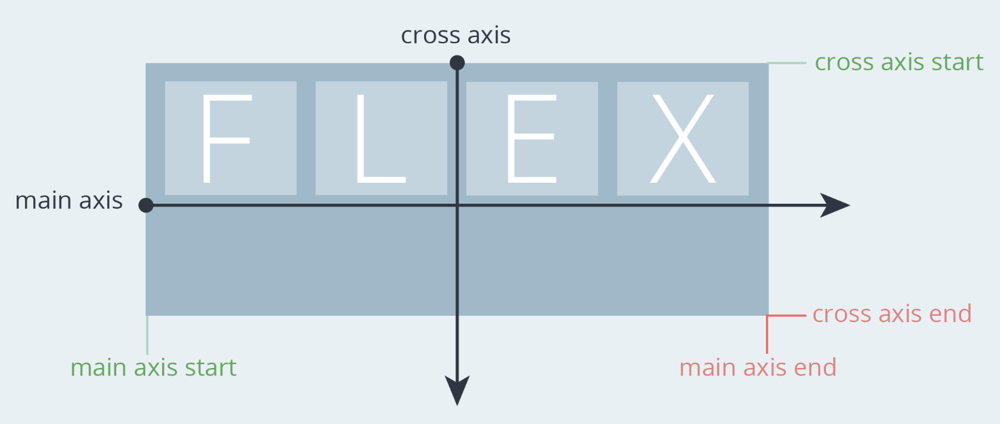
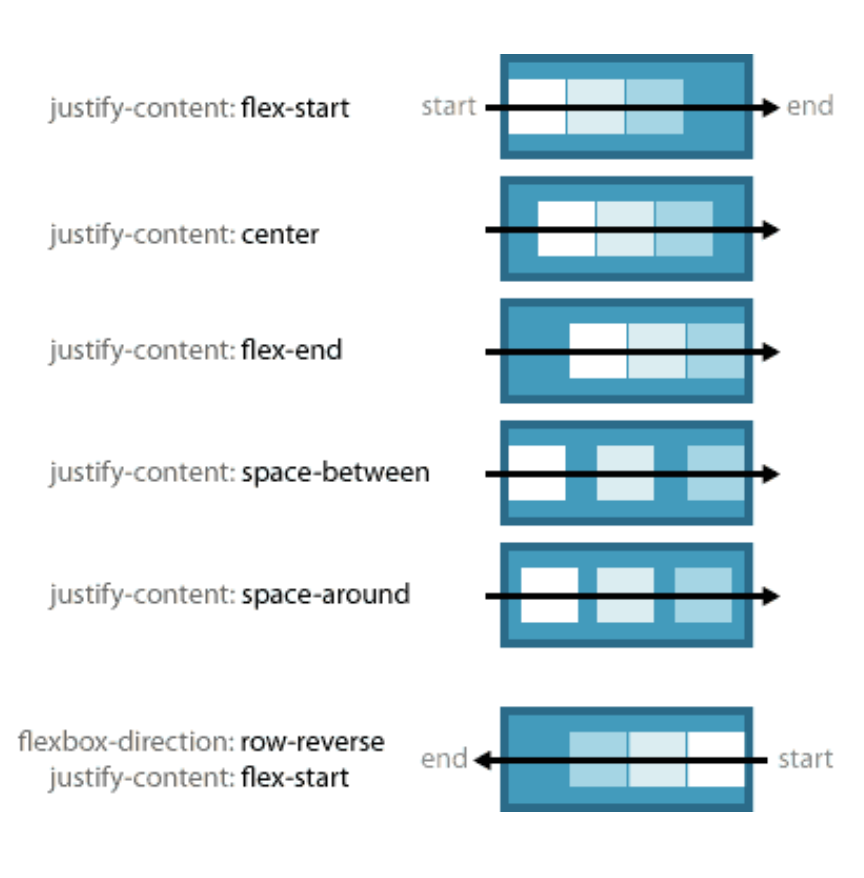

# [CSS] 포지션 배치 📝

## **Position 💭**

- 문서 상에서 요소의 위치를 지정
- `Static` : 모든 태그의 기본 값
  - 일반적인 요소의 배치 순서에 따름(좌측 상단)
  - 부모 요소 내에서 배치될 때는 부모 요소의 위치를 기준으로 배치됨
- 아래는 `좌표 프로퍼티(top, bottom, left, right)를 사용하여 이동 가능`

| 포지션   | 설명                                                                                                                                                                                                                                     | 비고 |
| -------- | ---------------------------------------------------------------------------------------------------------------------------------------------------------------------------------------------------------------------------------------- | ---- |
| relative | - **상대 위치**<br />- 자기 자신의 static 위치를 기준으로 이동(normal flow 유지)<br />- 레이아웃에서 요소가 차지하는 공간은 static일 때와 같음                                                                                           |      |
| absolute | - **절대 위치**<br />- **요소를 일반적인 문서 흐름에서 제거 후 레이아웃에 공간을 차지하지 않음(normal flow에서 벗어남)**<br />- static이 아닌 **가장 가까이 있는 부모/조상 요소를 기준으로 이동**(없는 경우 브라우저 화면 기준으로 이동) |      |
| fixed    | - **고정 위치**<br />- 요소를 일반적인 문서 흐름에서 제거 후 레이아웃에 공간을 차지하지 않음(normal flow에서 벗어남)<br />- **부모 요소와 관계없이 viewport를 기준으로 이동**<br />- **스크롤 시에도 항상 같은 곳에 위치**               |      |
| sticky   | - **스크롤에 따라 static -> fixed로 변경**<br />- 속성을 적용한 박스는 평소에 문서 안에서 position: static 상태와 같이 일반적인 흐름에 따르지만 스크롤 위치가 임계점에 이르면 position: fixed와 같이 박스를 화면에 고정할 수 있는 속성   |      |

<br />

---

# [CSS] Layout 📝

## **CSS layout techniques 💭**

- Display
- Position
- Float(CSS1, 1996)
- Flexbox(2012)
- Grid(2017)
- 기타
  - Responsive Web Design(2010), Media Queries(2012)

<br />

## **Flexbox 💭**

- `행과 열 형태`로 아이템들을 배치하는 1차원 레이아웃 모델
- `축`
  - main axis(메인 축)
  - Cross axis(교차 축)
- `구성 요소`
  - Flex Container(부모 요소)
  - Flex Item(자식 요소)

| 구성 요소            | 설명                                                                                                                           | 비고 |
| -------------------- | ------------------------------------------------------------------------------------------------------------------------------ | ---- |
| Flex container(부모) | - 레이아웃을 형성하는 가장 기본적인 모델<br />- Flex Item들이 놓여있는 영역<br />- display 속성을 flex 혹은 inline-flex로 지정 |      |
| Flex Item(자식)      | 컨테이너에 속해 있는 컨텐츠(박스)                                                                                              |      |
|                      |                                                                                                                                |

<br />

## **Flex 속성 💭**

| 구성 요소      | 속성                                                                                                                             | 비고 |
| -------------- | -------------------------------------------------------------------------------------------------------------------------------- | ---- |
| Flex container | - align-content<br />- align-items<br />- display<br />- flex-firection<br />- flex-flow<br />- flex-wrap<br />- justify-content |      |
| Flex item      | - align-self<br />- flex<br />- flex-basis<br />- flex-grow<br />- flex-shrink<br />- order                                      |      |
|                |                                                                                                                                  |

<br />



### **flex-direction**

- `Main axis 기준 방향 설정`
  - row(→) / column(↓) / row-reverse(←) / column-reverse(↑)
- 역방향(reverse)의 경우 HTML 태그 선언 순서와 시각적으로 다르니 유의(웹 접근성에 영향)

<br />

### **flex-wrap**

- `아이템이 컨테이너를 벗어나는 경우 해당 영역 내에 배치되도록 설정`
  - nowrap / wrap / wrap-reverse
- 즉, 기본적으로 컨테이너 영역을 벗어나지 않도록 함

<br />

### **flex-flow**

- `flex-direction + flex-wrap 값을 명시하는 단축 속성`

```css
.container {
  display: flex;
  flex-flow: direction wrap;
}
```

<br />



### **justify-content**

- `Main axis를 기준`으로 공간 배분
- 속성값



<br />

### **align-items**

- 모든 아이템을 `Cross axis를 기준`으로 정렬

<br />

### **align-self**

- `개별 아이템을 Cross axis 기준`으로 정렬

<br />

---

#### **참조 📚**

- Flexbox 연습하기 좋은 사이트 [클릭](https://flexboxfroggy.com/#ko)
- 공식 문서가 궁금하다면 [클릭](https://developer.mozilla.org/ko/docs/Web/CSS/CSS_Flexible_Box_Layout/Basic_Concepts_of_Flexbox)
- 정리된 블로거가 궁금하다면 [클릭](https://studiomeal.com/archives/197)
