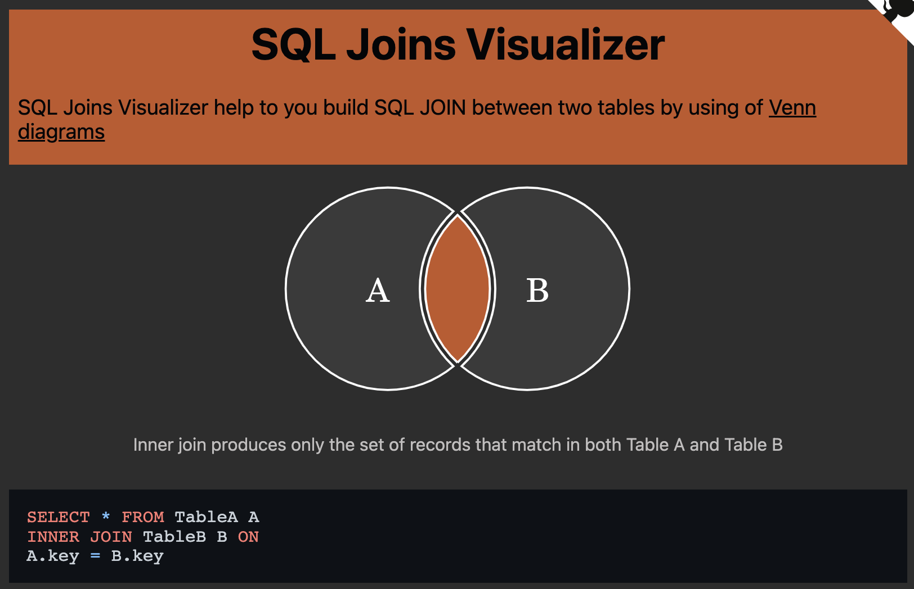
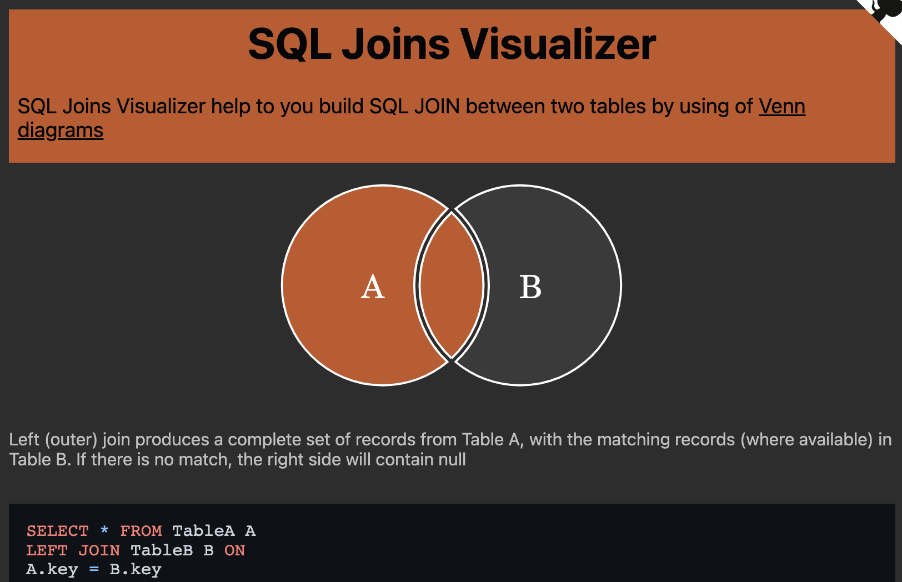
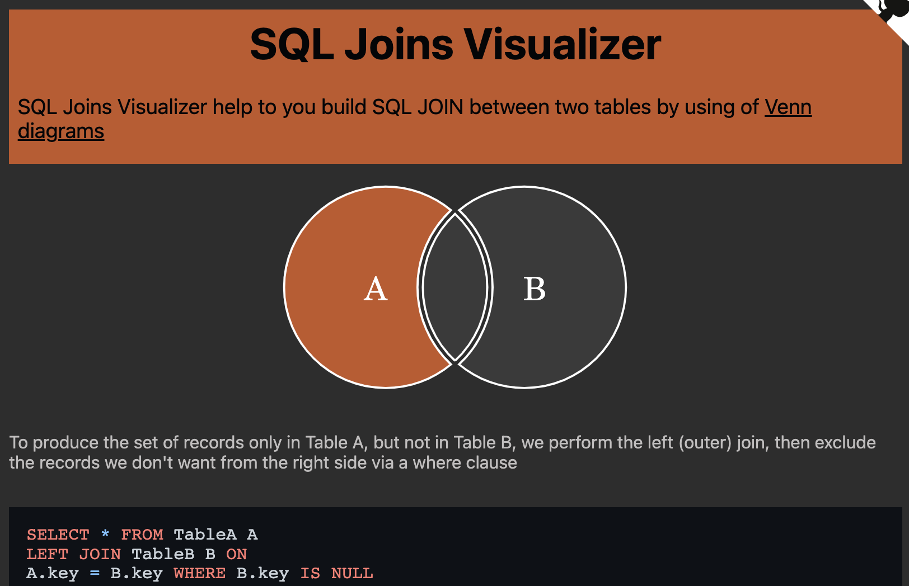
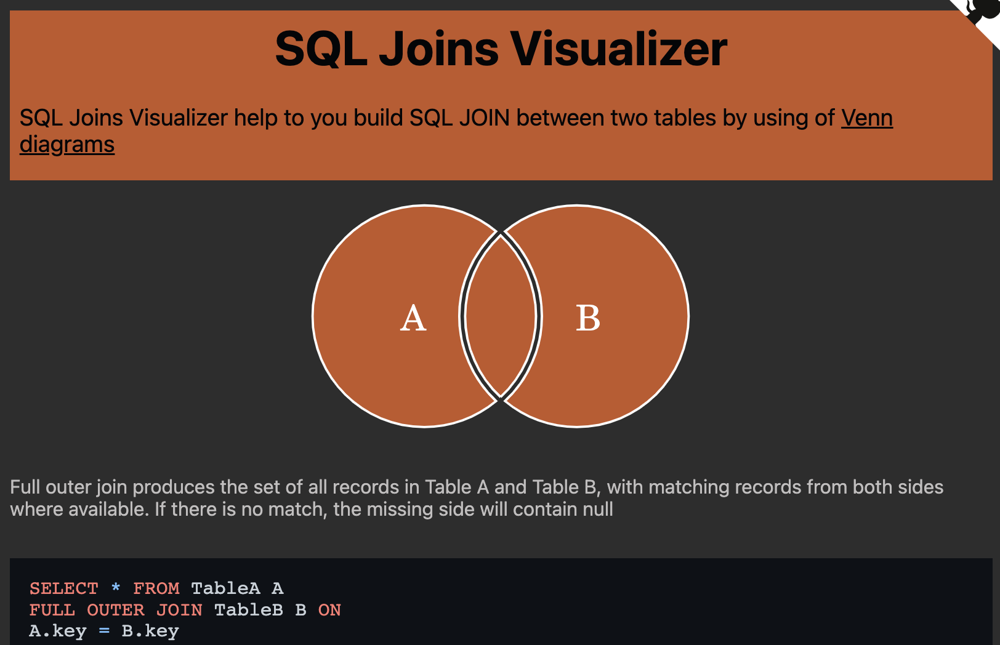

# [DB] Join 📝

## **JOIN이란** 💭

- **관계형 데이터베이스의 가장 큰 장점이자 핵심적인 기능**
- 일반적으로 데이터베이스에는 하나의 테이블에 많은 데이터를 저장하는 것이 아니라 `여러 테이블로 나눠 저장`하게 되며, `여러 테이블을 결합(Join)`하여 출력하여 활용
- 일반적으로 레코드는 `기본키(PK)나 외래키(FK) 값의 관계에 의해 결합`함

<br />

## **대표적인 JOIN 💭**

| JOIN       | 설명                                |
| ---------- | ----------------------------------- |
| INNER JOIN | 두 테이블에 모두 일치하는 행만 반환 |
| OUTER JOIN | 동일한 값이 없는 행도 반환          |
| CROSS JOIN | 모든 데이터의 조합                  |

<br />



### **INNER JOIN**

- `INNER 생략 가능`

```sql
SELECT * FROM 테이블1 [INNER] JOIN 테이블2 ON 테이블1.컬럼 = 테이블2.컬럼;
```

```sql
-- INNER JOIN : A와 B테이블에서 값이 일치하는 것들만💡
SELECT *
FROM users JOIN role
	ON users.role_id = role.id;


-- 이름과 제목을 조회하기
SELECT
	users.name,
	role.title
FROM users INNER JOIN role
	ON users.role_id = role.id;


-- 스태프(2)만 출력하기
SELECT *
FROM users JOIN role
	ON users.role_id = role.id;
WHERE role.id = 2;


-- 이름을 내림차순으로 출력하기
SELECT *
FROM users JOIN role
	ON users.role_id = role.id;
ORDER BY users.name DESC;


-- 3개 테이블 조인하기
SELECT *
FROM articles
	JOIN users
		ON articles.user_id = users.id
	JOIN role
		ON users.role_id = role.id;
```

<br />





### **OUTER JOIN**

- 기준이 되는 테이블에 따라 `LEFT, RIGHT, FULL`을 지정

```sql
SELECT * FROM 테이블1 [LEFT|RIGHT|FULL] OUTER JOIN 테이블2 ON 테이블1.컬럼 = 테이블2.컬럼;
```

```sql
-- LEFT OUTER JOIN
SELECT *
FROM articles LEFT OUTER JOIN users
	ON articles.user_id = users.id;


-- NULL값은 제외
SELECT *
FROM articles LEFT OUTER JOIN users
	ON articles.user_id = users.id
WHERE articles.user.id IS NOT NULL;


-- FULL OUTER JOIN
SELECT *
FROM articles FULL OUTER JOIN users
	ON articles.user_id = users.id;
```

<br />

### **CROSS JOIN**

- `모든 경우의 수`를 JOIN

```sql
SELECT * FROM 테이블1 CROSS JOIN 테이블2;
```
