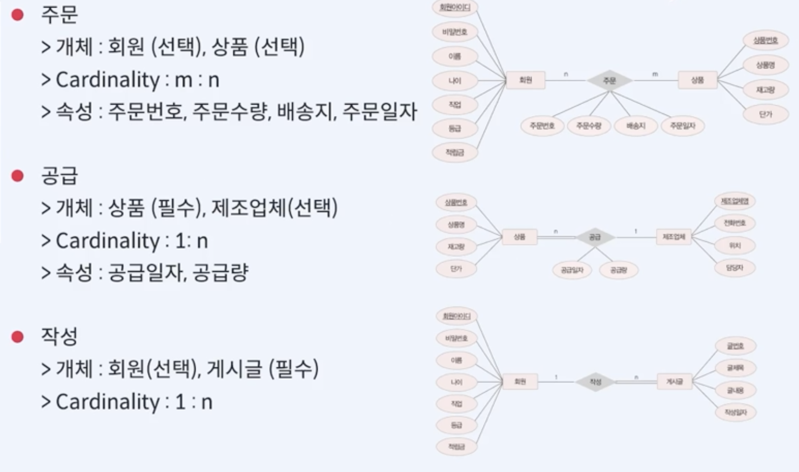

# [DB] 데이터베이스 설계 📝

> 사용자의 다양한 요구 사항을 고려하여 데이터베이스를 생성하는 과정

- 이미 구축된 데이터베이스는 구조를 변경하기 어려우므로 체계적인 설계 과정을 통해 데이터베이스가 올바르게 구축되어야 한다.
- 대표적인 설계 방법
  - `E-R 모델과 Relation 변환 규칙`을 이용한 설계
  - `정규화`를 이용한 설계

 

## **데이터베이스 설계 단계 💭**

1. **요구 사항 분석**
   - 실제 세계에서 어떤 요구사항의 시스템을 구출할 것인지에 대한 `데이터베이스의 용도 파악`
   - 요구 사항에 대해 `어떤 데이터들이 필요한지, 어떤 기능들이 필요한지 분석`
2. **개념적 설계**
   - 요구 사항 분석 결과물을 개념적 데이터 모델을 이용해 `개념적 구조로 표현`
   - 요구 사항 명세서를 `E-R 다이어그램으로 표현`
3. **논리적 설계**
   - 관계 모델을 통해 개념적 모델을 논리적으로 표현
4. **물리적 설계**
   - `DBMS로 구현이 가능한 물리적인 구조를 설계`
   - 저장 레코드 타입 및 인덱스 타입 등 설계

 

### **요구 사항 분석**

- 데이터베이스를 사용할 주요 사용자의 범위 결정
- 사용자가 수행하는 업무를 분석
- 수집된 요구 사항에 대한 분석 결과를 요구 사항 명세서에 표현

 

### **개념적 설계**

- DBMS에 독립적인 개념적 스키마를 설계하는 과정
- 요구 사항 분석 결과를 기반으로 중요한 개체를 추출하고 개체 간의 관계를 결정하여 E-R 다이어그램으로 표현
- 작업 과정

  1. `개체 추출`, 각 개체의 주요 속성과 키 속성 선별
     - 개체란, 저장할 만한 가치가 있는 중요한 데이터를 가진 사람이나 사물 등을 말한다.

  

  2. `관계 추출`
     - 관계란, 개체 간의 의미 있는 연관성을 말한다.
     - 관계 추출 방법
       - 요구 사항 문장에서 개체 간의 연관성을 의미 있게 표현한 동사를 찾는다.
       - 찾아낸 관계에 대해 매핑 Cardinality 와 참여 특성을 결정한다.
         - 매핑 Cardinality : 1:1, 1:N, M:N

  
