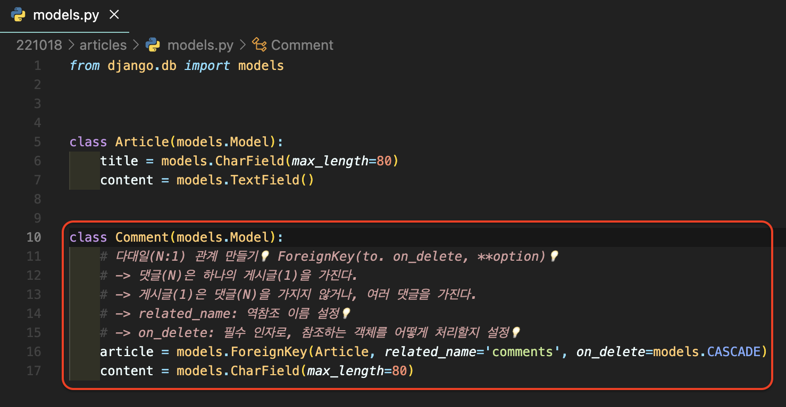

# [Django] 댓글 만들기 📝

> **댓글과 게시글은 다대일(N:1)의 관계**를 가지고, Django에서는 **외래키(Foreign Key)를 설정**함으로 관계를 정의합니다.

 

## **Foreign Key 📙**

> **A one-to-many relationship**

- `필수 옵션`: 참조 모델, on_delete

 

## **역참조 📘**

> Comment 모델은 Article 모델을 참조하고 있어 바로 접근이 가능하고, **역참조는 반대로 Article 모델이 Comment 모델에 접근하는 것**을 말합니다.

 

## **댓글 생성 및 삭제 📕**

