# [Django] CRUD 📝

> 프로젝트와 앱 생성 이후 url 설정을 진행했다는 가정하에 작성하였습니다.

 

## **DB 설계 💭**

> - 모델 생성 후 manage.py 명령 실행
>   - `python manage.py makemigrations`
>   - `python manage.py migrate`

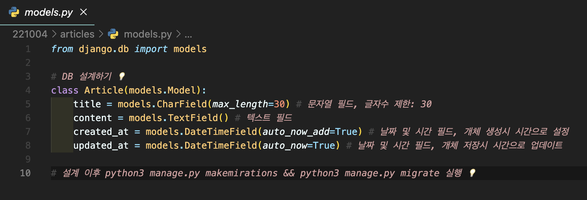

 

## **CRUD 구현 💭**

> url로 요청 📩 받아 view에서 처리 🧩 하고 template으로 응답 📤 하는 과정을 반복합니다.

 

### **1. url 요청 📩**

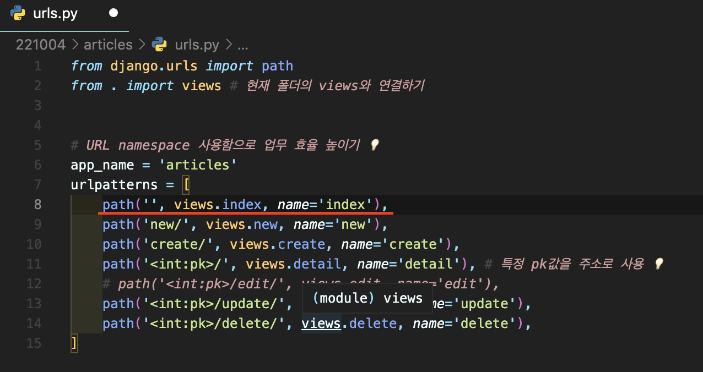

 

### **2. view에서 처리 🧩**

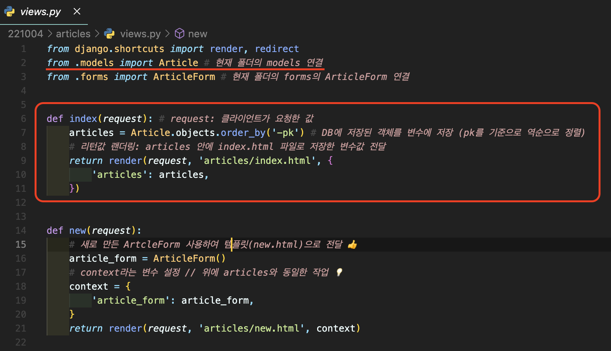

 

### **3. template으로 응답 📤**

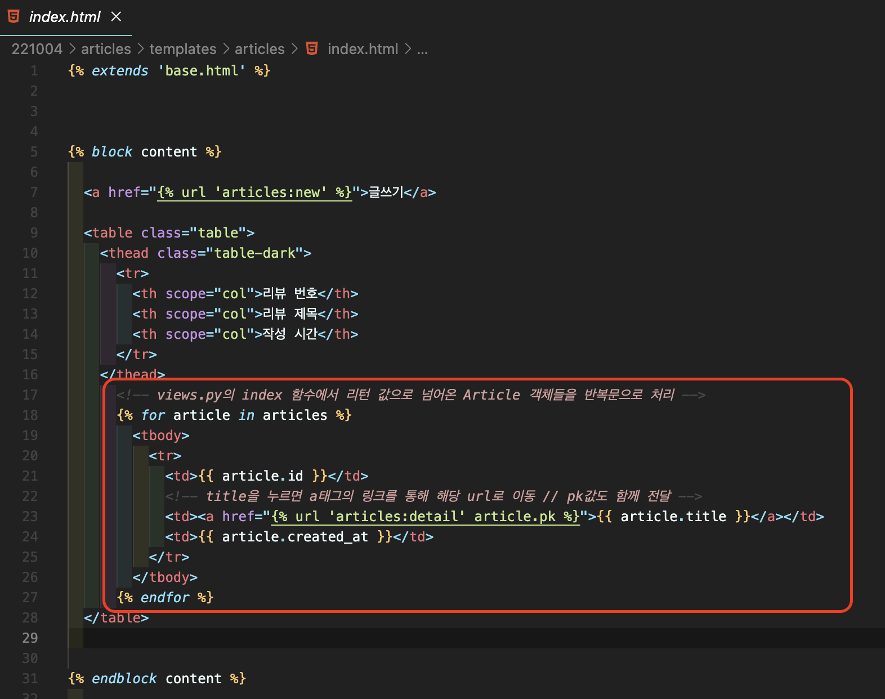

 

### **CREATE 📗**

> 요청(url) -> 처리(view) -> 응답(template)으로 데이터 생성하기 💡
>
> - Form에서 URL 요청하기
> - `action : 데이터를 전송할 주소 입력`
> - `method : 데이터 전송 방식 입력`
> - 요청 후 urls.py 경로를 통해 view.py로 이동

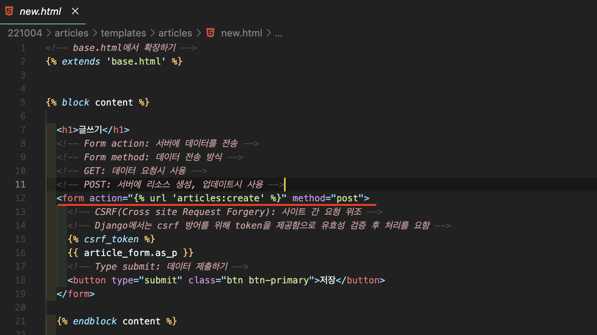

 

> - 함수 로직을 통해 템플릿으로 리턴 값 랜더링
> - `ArticleForm() : 새롭게 정의한 폼` 으로 아래 사진 참조

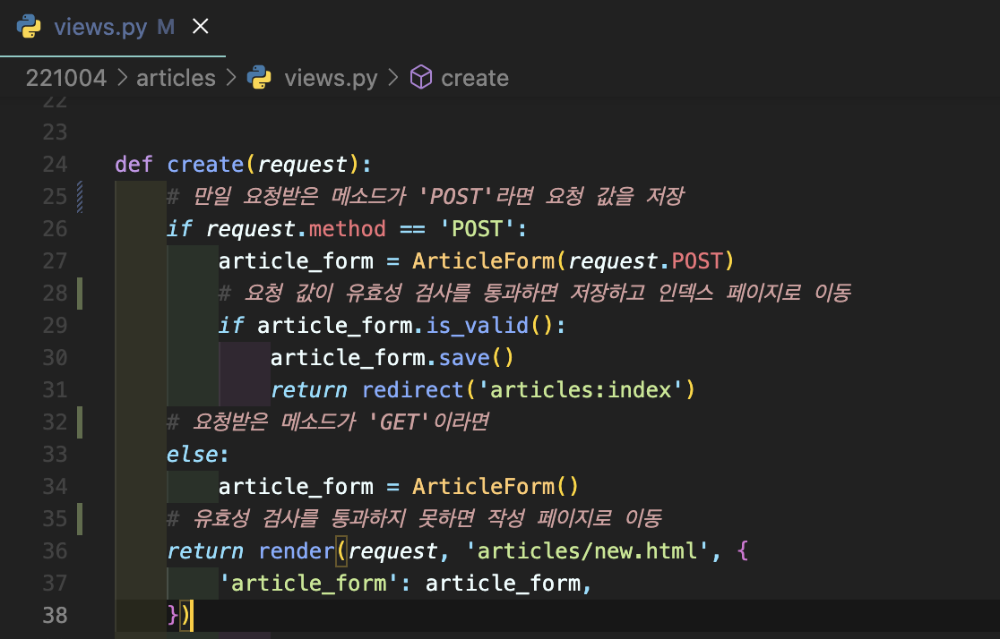

 

> - forms 라이브러리의 ModelForm 클래스를 상속
> - 정의한 클래스 안에 Meta 클래스를 선언하여 정보를 작성
> - model class인 Aticle을 참조하고 이를 Form에 적용

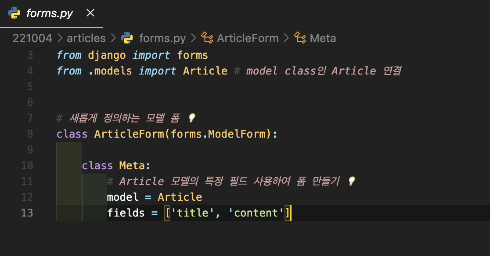

 

### **READ 📒**

> 요청(url) -> 처리(view) -> 응답(template)으로 데이터 조회하기 💡
>
> - URL 경로는 상단의 1번 URL 사진을 참조 👍
> - 특정 객체를 조회하기 위해서는 객체 고유한 값인 pk 값을 인자로 받아 사용하며,
> - 가져온 값을 template으로 랜더링하니다.

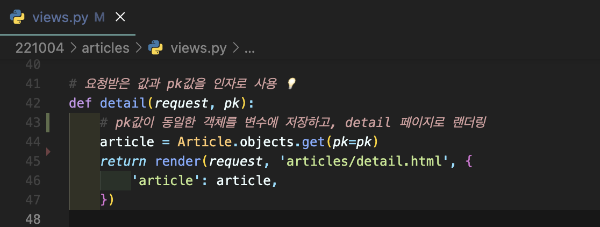

 

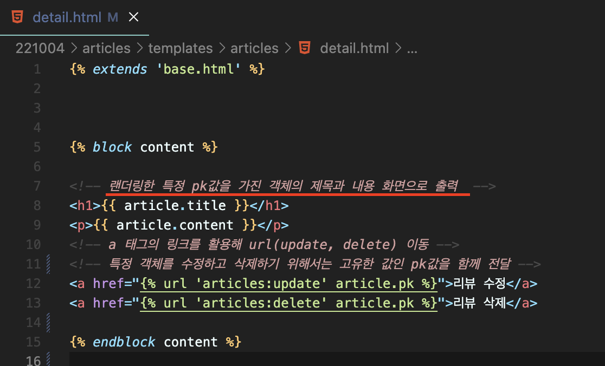

 

### **UPDATE 📙**

> 요청(url) -> 처리(view) -> 응답(template)으로 데이터 수정하기 💡
>
> - URL 경로는 상단의 1번 URL 사진을 참조 👍
> - 특정 데이터를 수정하기 위해서는 고유한 값인 pk 값이 필요하고,
> - 정의한 Form에 값을 넣기 위해서 `instance를 정의`하게 됩니다.
> - 유효성 검사를 통과하면 요청 값을 저장해 리턴하고,
> - 통과하지 못했다면 수정 페이지로 리턴합니다.

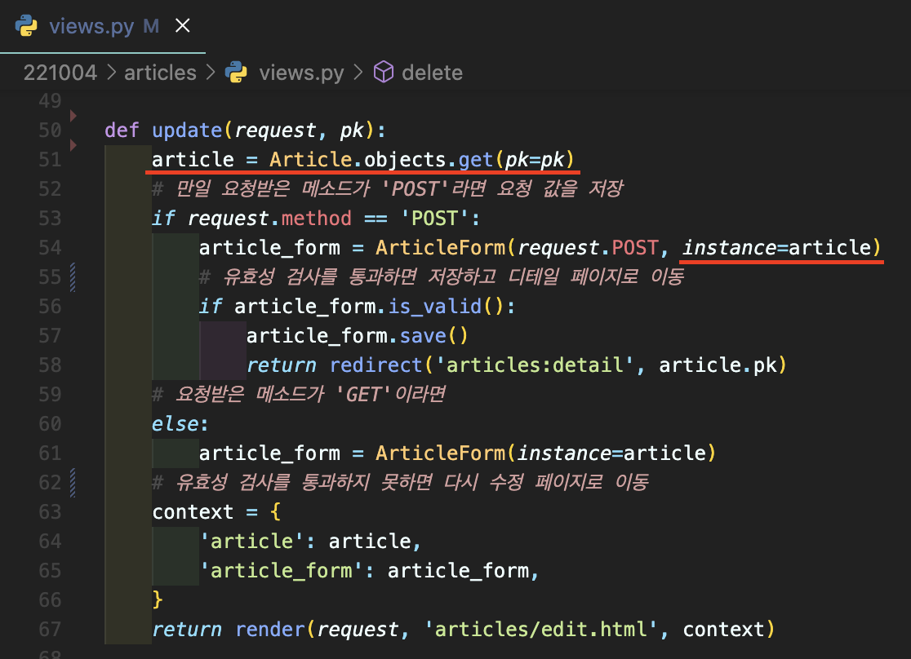

 

### **DELETE 📕**

> 요청(url) -> 처리(view) -> 응답(template)으로 데이터 삭제하기 💡
>
> - URL 경로는 상단의 1번 URL 사진을 참조 👍
> - 특정 데이터를 삭제하기 위해서는 고유한 값인 pk 값을 사용하며,
> - 모델에서 pk 값이 동일한 객체를 가져와 삭제하고 index 페이지로 랜더링합니다.

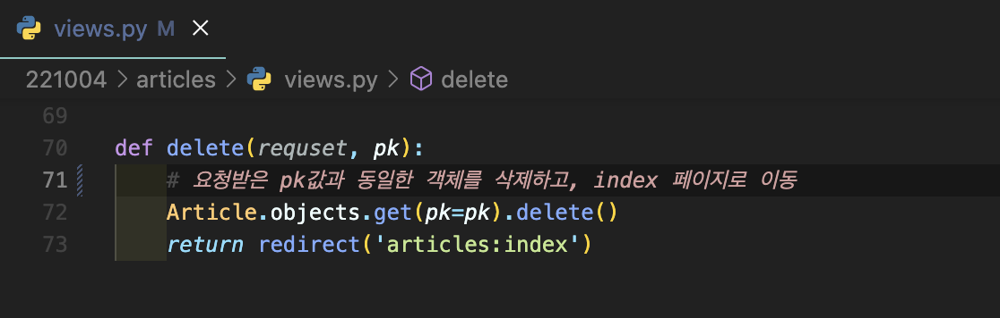
