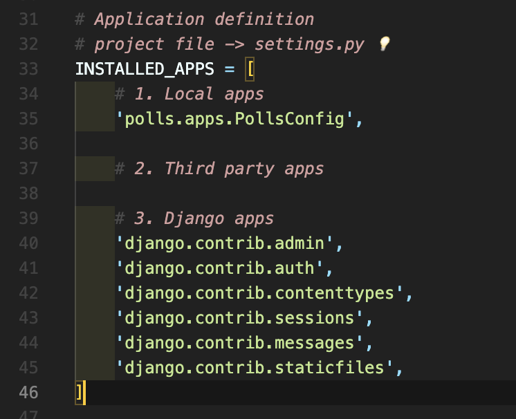

# [Django] 프로젝트 파일 구조 📝

> 장고는 웹 프레임워크로 잘 짜여진 구조에 맞춰서 사용해야 합니다

<br />

---

## **기본 디렉토리 및 파일 구조 💭**

```
프로젝트 파일/
	__init__.py
	asgi.py
	settings.py
	urls.py
	wsgi.py
venv/
manage.py
```

<br />

### **\_\_init\_\_.py 📒**

- Python에게 이 디렉토리를 하나의 Python 패키지로 다루도록 지시
- 별도로 추가 코드를 작성하지 않음

<br />

### **asgi.py 📒**

- Asynchronous Server Gateway Interface
- Django 애플리케이션이 비동기식 웹 서버와 연결 및 소통하는 것을 도움
- 추후 배포 시에 사용

<br />

### **settings.py 📒**

- `Django 프로젝트 설정을 관리`

<br />

### **urls.py 📒**

- `사이트의 url과 적절한 view의 연결을 지정`

<br />

### **wsgi.py 📒**

- Web Server Gateway Interface
- Django 애플리케이션이 웹 서버와 소통하는 것을 도움
- 추후 배포 시에 사용

<br />

### **manage.py 📒**

- `Django 프로젝트와 다양한 방법으로 상호작용하는 커맨드라인 유틸리티`

```bash
python manage.py 커맨드 옵션
```

<br />

---

## **앱 생성 및 파일 구조 💭**

<br />

### **앱 생성하기 📙**

- 일반적으로 `앱 이름은 복수형`으로 작성

```bash
python manage.py startapp 앱이름
```

```
앱 파일/
	migrations/
	__init__.py
	admin.py
	apps.py
	models.py
	tests.py
	views.py
```

<br />

### **admin.py 📙**

- `관리자용 페이지를 설정하는 곳`

<br />

### **apps.py 📙**

- 앱의 정보가 작성되는 곳
- 별도로 추가 코드를 작성하지 않음

<br />

### **models.py 📙**

- 애플리케이션에서 사용하는 `model을 정의하는 곳`
- MTV 패턴의 M에 해당

<br />

### **tests.py 📙**

- 프로젝트의 테스트 코드를 작성하는 곳

<br />

### **views.py 📙**

- `view 함수들이 정의되는 곳`
- MTV 패턴의 V에 해당

<br />

---

## **INSTALLED_APPS 💭**

> 프로젝트에서 앱을 사용하기 위해서는 반드시 INSTALLED_APPS 리스트에 반드시 추가해야 합니다.

- Django installation에 `활성화된 모든 앱을 지정하는 문자열 목록`



<br />

---

## **Project & Application 💭**

| Project                                                                                         | Application                                                                                                                 |
| ----------------------------------------------------------------------------------------------- | --------------------------------------------------------------------------------------------------------------------------- |
| - 프로젝트는 엡의 집합<br />- 여러 앱이 포함될 수 있음<br />- 앱은 여러 프로젝트에 있을 수 있음 | - 실제 요청을 처리하고 페이지를 보여주는 등의 역할을 담당<br />- 일반적으로 하나의 역할 및 기능 단위로 작성하는 것을 권장함 |
|                                                                                                 |                                                                                                                             |
