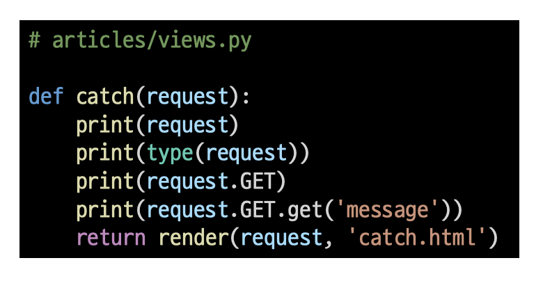

# [Django] Form data 📝

> 데이터를 보내고 가져오기

- `클라이언트(일반적으로 웹 브라우저)가 서버에 요청을 보내고, 서버는 클라이언트의 요청에 응답`
- 클라이언트 측에서 HTML form은 HTTP 요청을 서버에 보내는 가장 편리한 방법
- 이를 통해 사용자는 HTTP 요청에서 전달할 정보를 제공할 수 있음

<br />

---

## **Sending form date(Client) 💭**

> "데이터를 어디(action)로 어떤 방식(method)으로 보낼지"

- 데이터가 전송되는 방법을 정의
- 웹에서 사용자 정보를 입력하는 여러 방식(text, button, submit)을 제공하고, `사용자로부터 할당된 데이터를 서버로 전송하는 역할을 담당`

<br />

### **action 📒**

- `입력 데이터가 전송될 URL 지정`
- 데이터를 어디로 보낼 것인지 지정하는 것이며, 이 값은 반드시 유효한 URL이어야 함
  - 만약 이 속성을 지정하지 않으면 데이터는 현재 form이 있는 페이지의 URL로 보내짐

<br />

### **method 📒**

- `데이터를 어떻게 보낼 것인지 정의`
- 입력 데이터의 HTTP request methods 지정
- HTML form 데이터는 오직 2가지 방법으로 전송하게 됨
  - `GET방식 또는 POST방식`

<br />

### **\<input> element 📒**

- `사용자로부터 데이터를 입력받기 위해 사용`
- type 속성에 따라 동작 방식이 달라짐


<br />

### **HTML input's attribute: name 📒**

```
- form을 통해 데이터를 제출(submit)했을 때 name 속성에 설정된 값을 서버로 전송하고, 서버는 name 속성에 설정된 값을 통해 사용자가 입력한 데이터 값에 접근할 수 있다.
- 주요 용도는 GET/POST 방식으로 서버에 전달하는 파라미더(name=key, value=value)로 매핑한다.
- GET 방식에서는 URL 형식으로 데이터를 전달한다.
```

<br />

---

## **HTTP request methods 💭**

<br />

### **HTTP 📗**

> HTML 문서와 같은 리소스(데이터, 자원)들을 가져올 수 있도록 해주는 프로토콜(규칙, 규약)

- 웹에서 이루어지는 모든 데이터 교환의 기초

문서내 이동 1

<br />

### **GET 📗**

- `서버로부터 정보를 조회하는 데 사용`
- 데이터를 가져올 때만 사용해야 함
- 데이터를 서버로 전송할 때 Query String Parameters를 통해 전송
  - 데이터는 URL에 포함되어 서버로 전송

<br />

### **Query String Parameters 📗**

- 사용자가 입력 데이터를 전달하는 방법 중 하나로, `url 주소에 데이터를 파라미터를 통해 넘기는 것`
- 이러한 문자열은 엠퍼샌드(&)로 연결된 key=value 쌍으로 구성되며, 기본 URL과 물음표(?)로 구분됨
  - 예시 :` http://host:port/path?key=value&key=value`
- 파라미터가 여러 개일 경우 "&"를 붙여 여러 개의 파라미터를 넘길 수 있음

<br />

---

## **Sending form date(Server) 💭**

> "데이터 가져오기(검색하기)"

- `서버는 클라이언트로 받은 key-value 쌍의 목록과 같은 데이터를 받게 됨`
- 이러한 목록에 접근하는 방법은 사용하는 특정 프레임워크에 따라 다름

<br />

### **데이터 가져오기 📘**

> "모든 요청 데이터는 view 함수의 첫번째 인자 request에 들어있다"




<br />

---

## **Django URLs 💭**

> Django는 URL 끝에 /가 없다면 자동으로 붙여주는 것이 기본 설정

- `Trailing URL Slashes`

```
- 검색 엔진 로봇이나 웹 트래픽 분석 도구에서는 끝에 /의 유무에 따라 다른 페이지로 인식한다. 그렇기 때문에 Django는 URL을 정규화하여 혼동하지 않게 해야 한다.
```
