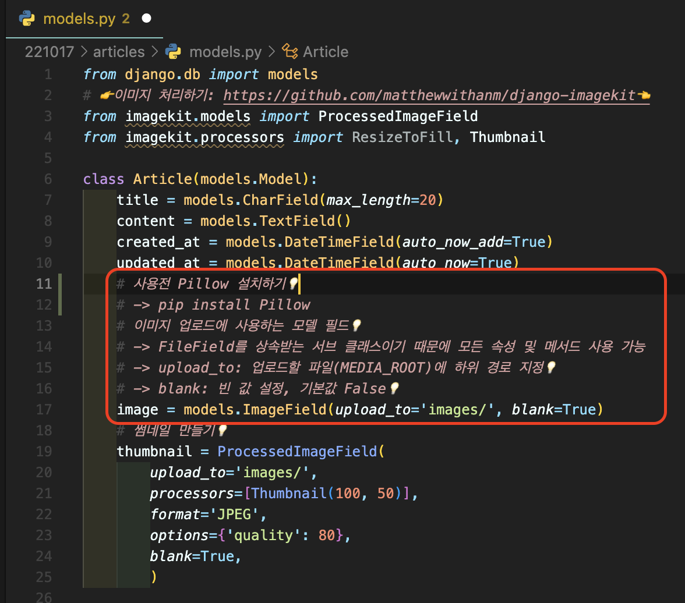
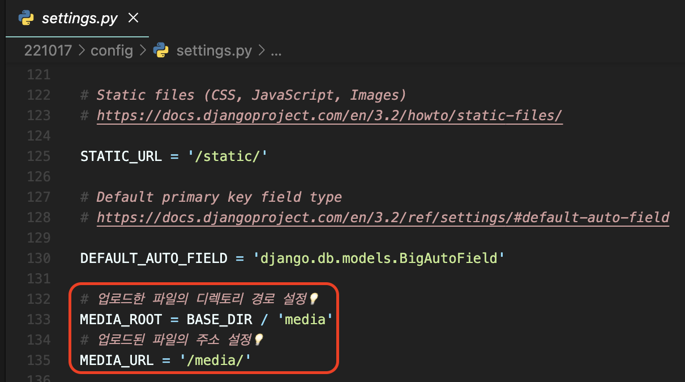
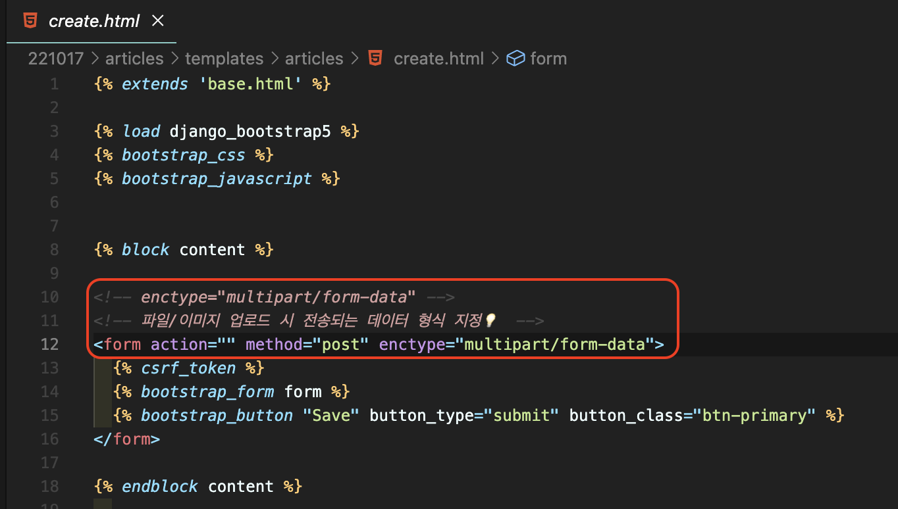
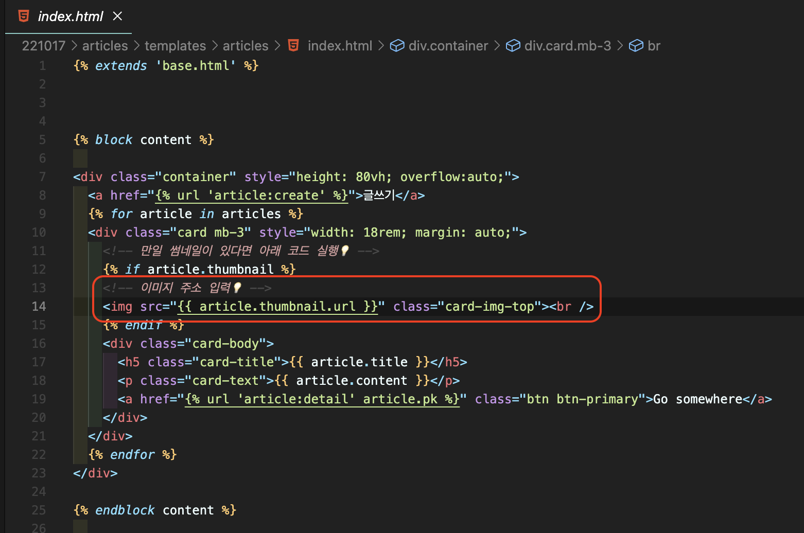
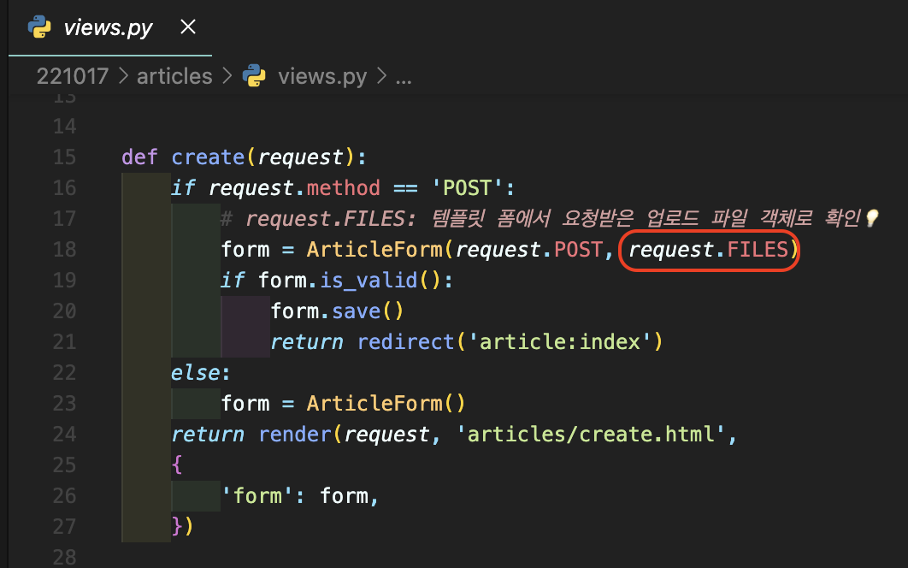
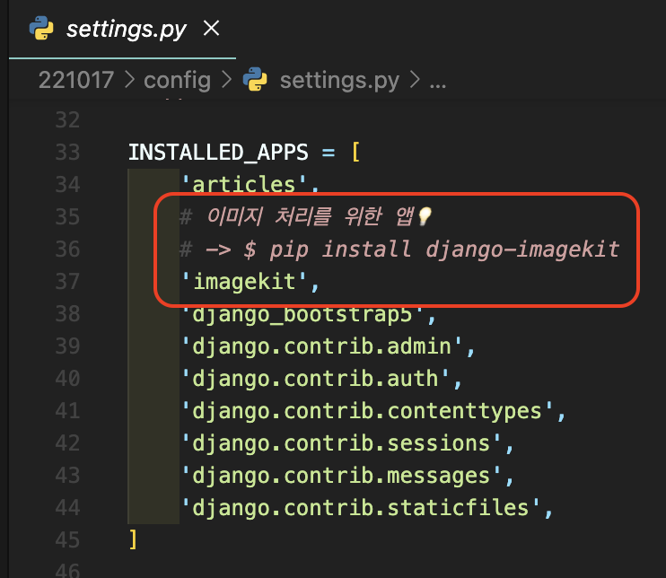
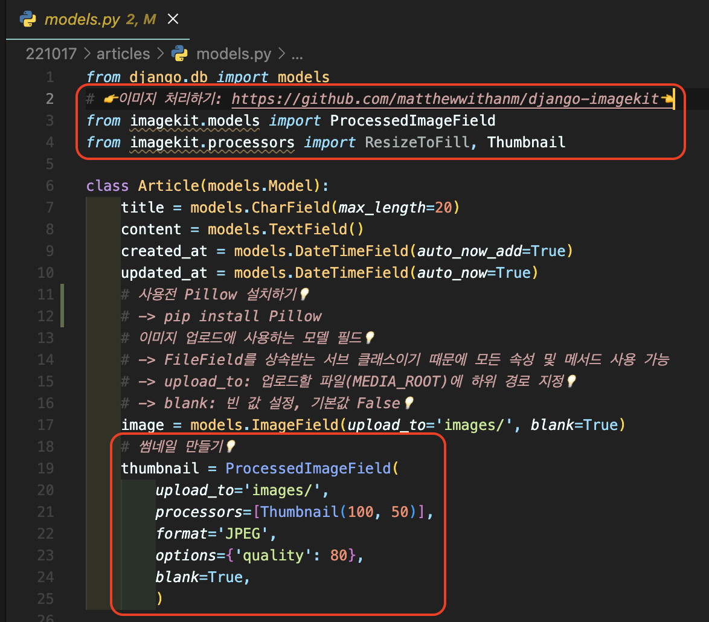

# [Django] 이미지 첨부하기 📝

> 이미지를 첨부하기 위해서는 **ImageField 모델 설정**이 필요합니다. 해당 모델을 사용하기 위해서는 **이미지 처리 라이브러리인 Pillow를 설치**해야 하며, **업로드된 이미지를 저장할 별도 파일의 경로와 주소를 지정**합니다.
>
> 이미지를 전송할 때 **템플릿에서는 데이터 형식(enctype="")을 지정하고, 서버에서는 요청받은 객체 파일(request.FILES)을 받아야 합니다.**

 

## **ImageField 📒**

> **이미지 모델 설정**

 

## **ROOT & URL 📙**

> **이미지 경로 설정**

 

## **Templates 📘**

> **서버로 이미지 전송하기**

> **서버에서 이미지 불러오기**

 

## **Views 📕**

> **클라이언트가 요청한 이미지 저장하기**

 

---

# [Django] 이미지 사이즈 조정하기 📝

> **이미지를 원본 그대로 업로드하는 것은 서버에 큰 부담**일 수 있으니, 업로드될 때 이미지 자체를 resizing하는 방법을 고려합니다.

 

## **Django-imagekit 💭**

---

### **settings.py**

 

### **models.py**

