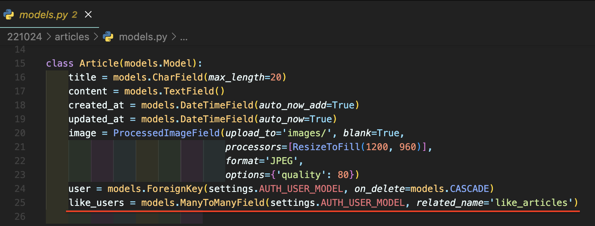
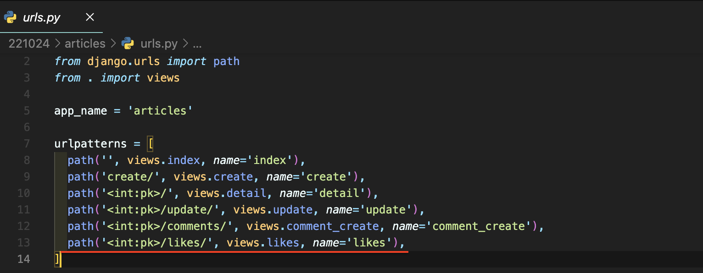
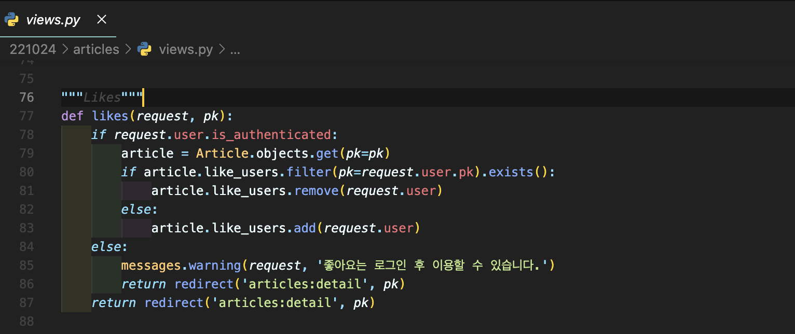
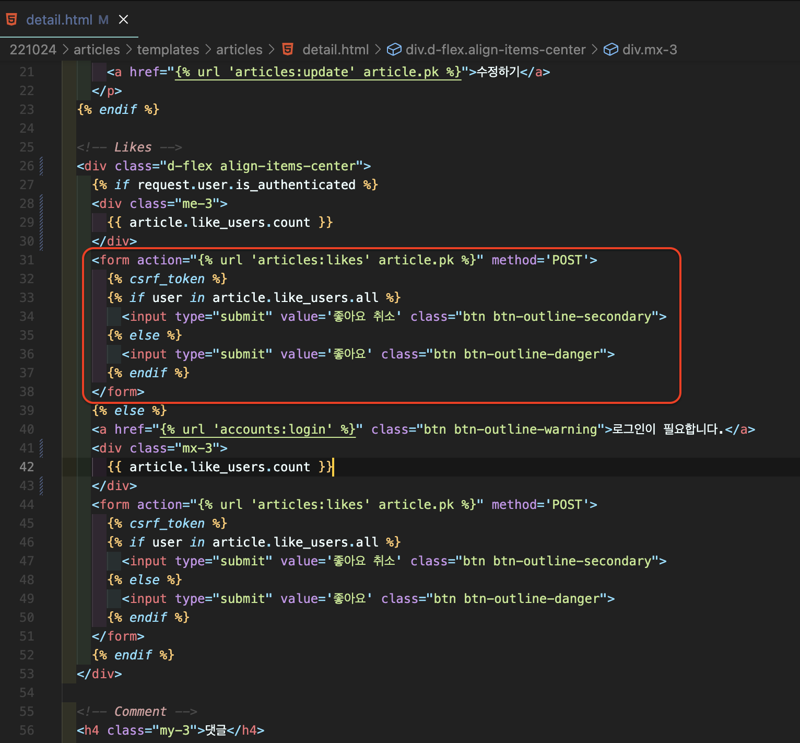
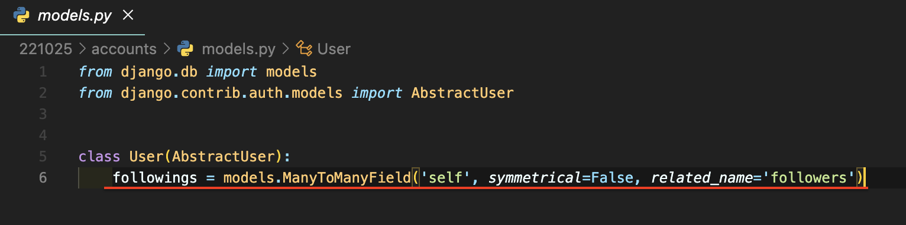
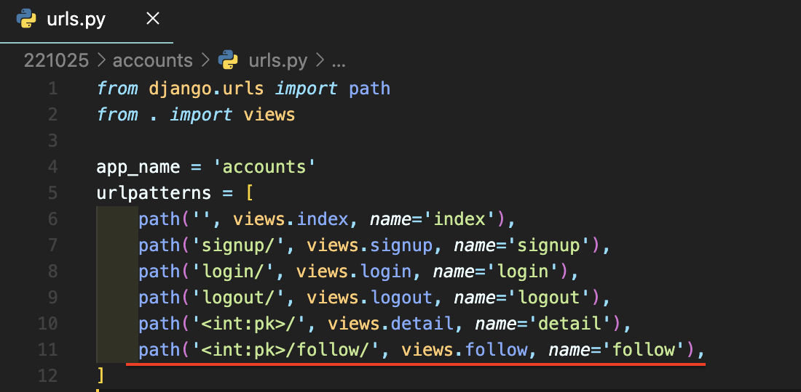
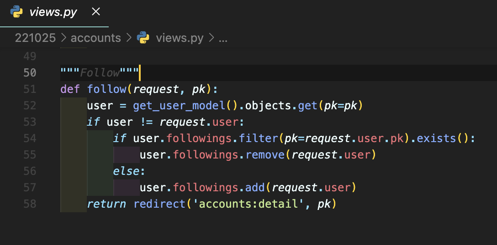
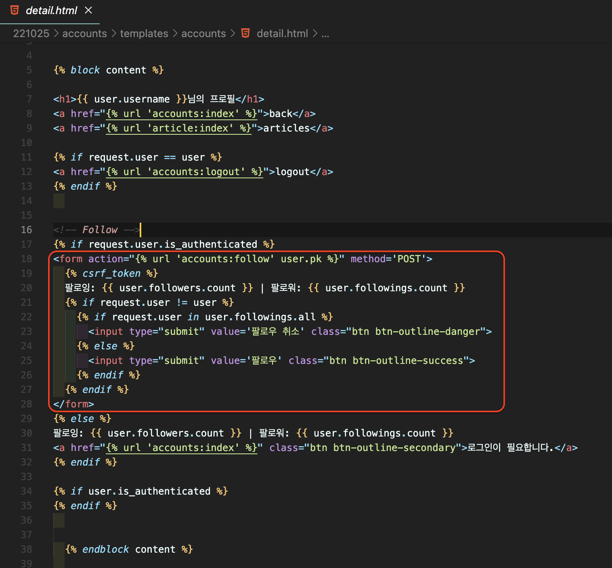

# [Django] 좋아요 & 팔로우 만들기 📝

> **좋아요와 게시글은 다대다(M:N) 관계**를 가지고, Django에서는 **ManyToManyField로 사용**함으로 관계를 정의합니다.

<br/>

## **ManyToManyField 📕**

> Django에서는 다대다 관계를 표현하는 **중개 테이블을 자동으로 생성**합니다.

<br/>

### **options\***

- `Related_name`: 역참조시 사용할 이름 지정
- `Through`: 중개 테이블을 직접 작성할 때에 사용

<br/>

## **Related Manager 📙**

> Django에서는 **모델 간 관계(N:1 or M:N)가 설정되면 역참조시 사용**할 수 있는 manager를 사용합니다.

<br/>

### **methods\***

> 공식 문서 클릭 -> https://docs.djangoproject.com/en/4.1/ref/models/relations/

- `add`
  - '지정된 객체를 관련 객체 집합에 추가'
  - 이미 존재하는 관계에 사용하면 관계가 복제되지 않음
  - 모델 인스턴스, 필드 값(PK)을 인자로 허용
- `remove`
  - '관련 객체 집합에서 지정된 모델 개체를 제거'
  - 내부적으로 QuerySet.delete()를 사용하여 관계가 삭제됨
  - 모델 인스턴스, 필드 값(PK)을 인자로 허용

<br/>

## **LIKES 📘**

> 게시글의 좋아요(Article)과 유저(User)는 M:N 관계를 가집니다.

<br/>

### **MODEL**



<br/>

### **URL**



<br/>

### **VIEWS**



<br/>

### **TEMPLATE**



---

<br/>

```
🙌 User - Article / related manager 🙌

N:1 👈
- article.user
  : 게시글을 작성한 유저
- user.article_set
  : 유저가 작성한 게시글

M:N 👈
- article.like_users
  : 게시글을 좋아요한 유저
- user.like_articles
  : 유저가 좋아요한 게시글
```

<br/>

---

## **Follow 📗**

> 유저는 많은 사용자를 팔로우할 수 있고, 많은 사용자는 유저를 팔로우할 수 있습니다. 팔로우(Follow)는 M:N 관계를 가집니다.

<br/>

### **MODEL**

- `'self'`: 유저는 유저 자신을 참조
- `symmetrical`: 대칭 관계 설정
  - False: 대칭 관계가 아님 - 페이스북 팔로우, 팔로잉
  - True: 대칭 관계 - 싸이월드 일촌
- `related_name`: 역참조시 사용할 이름 지정



<br/>

### **URL**



<br/>

### **VIEWS**



<br/>

### **TEMPLATE**


