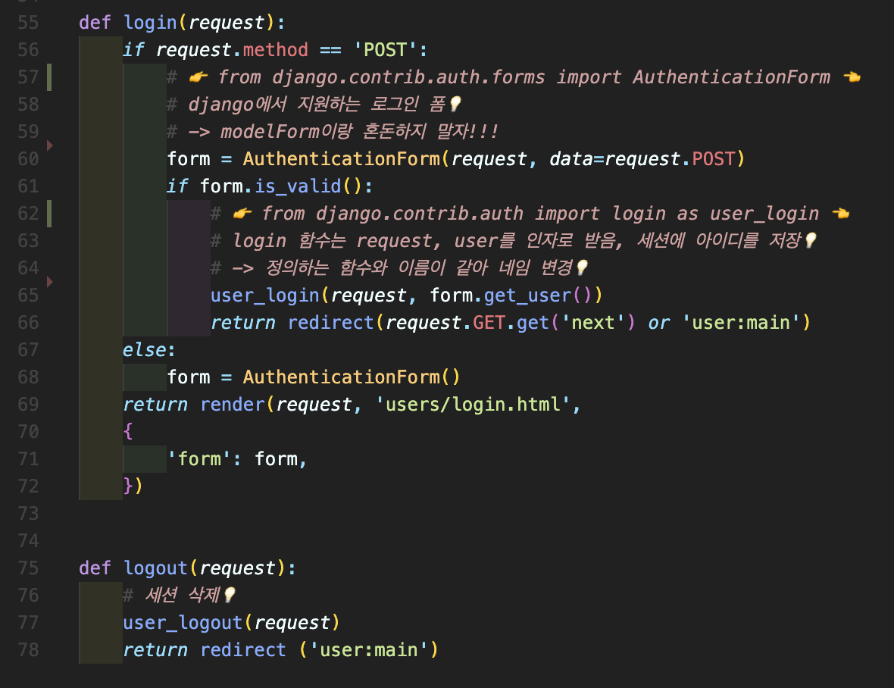
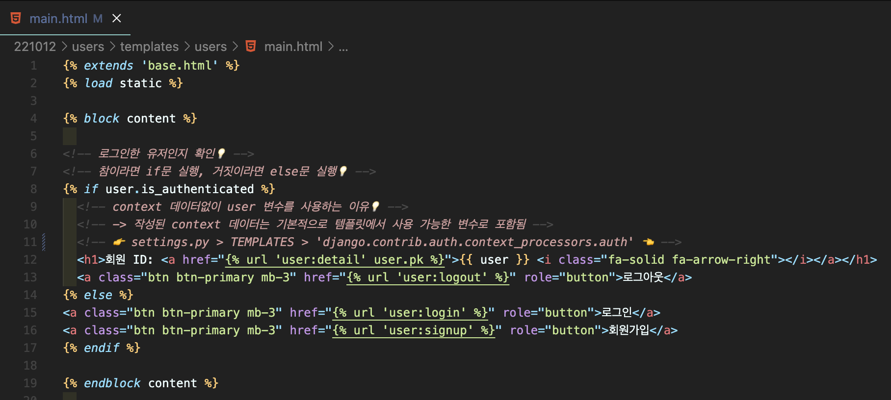
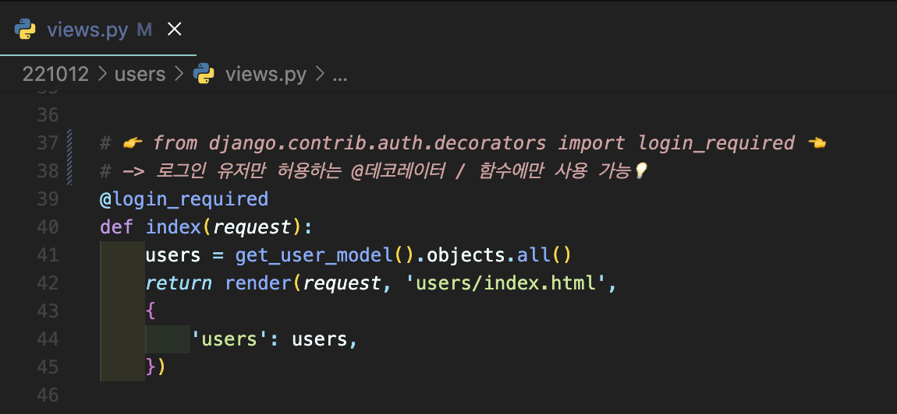

# [Django] 로그인 📝

> HTTP란, 클라이언트와 서버가 서로 통신할 수 있도록 만들어진 일종의 규약을 말하고, `비연결지향(connectionless)`, `무상태(stateless)`라는 특징을 가집니다. 즉, 서버는 클라이언트의 요청에 응답을 보낸 뒤 통신 연결을 끊으며, 연결이 끊기는 순간 상태 정보는 유지되지 않습니다.
>
> 이와 같은 특징을 보완하기 위해서는 혹은 로그인 상태를 유지하지 위해서는 `쿠키와 세션` 을 사용하게 되고, Django는 이를 지원합니다.
>
> https://docs.djangoproject.com/en/3.2/topics/http/sessions/

<br />

## **쿠키(Cookie) 🍪**

- 서버가 사용자의 `웹 브라우저(클라이언트)에 전송하는 작은 데이터(키와 값으로 구성된) 조각`
- 서로 다른 요청이 동일한 브라우저로부터 발생한 것인지 판단할 때 주로 사용

<br />

### **쿠키 사용 목적**

- `세션 관리 (Session management)`
  - 로그인, 아이디 자동완성, 공지 하루 안보기, 팝업 체크, 장바구니 등의 정보 관리
- `개인화 (Personalization)`
  - 사용자 선호, 테마 등의 설정
- `트래킹 (Tracking)`
  - 사용자 행동을 기록 및 분석

<br />

## **세션(Session) 💭**

- 사이트와 `특정 브라우저 사이의 state(상태)를 유지`시키는 것
- 서버는 클라이언트를 구분하기 위해 Session ID를 발급하고, 이를 쿠키에 저장

<br />

```
쿠키와 세션의 가장 큰 차이점은 사용자의 <정보가 저장되는 위치> 입니다. 세션은 서버측에서 관리하는만큼 보안은 우수하지만, 서버 데이터를 사용하기 때문에 무분별하게 사용하기에는 적합하지 않습니다.
```

<br />

---

## **로그인/아웃 로직 작성하기 🧩**



---

## **익명의 사용자 접근 제한하기 🖐**

> templates에서 조건문을 활용한 방법과 views에서 데코레이터를 활용한 방법 두 가지가 있습니다.

<br />

- `is_authenticated`



<br />

- `@login_required`


