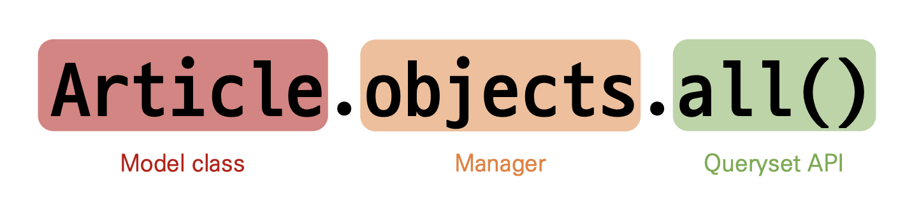

# [Django] Model 📝

> Django는 Model을 통해 데이터에 접근하고 조작합니다.

<br />

## **Model 💭**

- 사용하는 데이터들의 필수적인 필드들과 동작들을 포함
- 저장된 데이터베이스의 구조(layout)
- 일반적으로 각각의 모델은 하나의 데이터베이스 테이블에 매핑(mapping)
  - model class 1 == database table 1

<br />

## **작성하기 💭**

### **1. 프로젝트 및 앱 생성 📒**

```bash
# 프로젝트 생성
django-admin startproject 프로젝트이름 .

# 앱 생성
python manage.py startapp 앱이름
```

<br />

### **2. 앱 등록 📒**

```python
# settings.py
INSTALLED_APPS = [
  '앱이름',
  ...
]
```

<br />

### **3. 모델 작성 📒**

- `"Model class == table schema"`

```python
# 앱이름/models.py
class 앱이름(models.Model):
  title = models.CharField(max_length=10)
  content = models.TextField()
```

- `CharField(max_length=None, **options)`
  - 길이의 제한이 있는 문자열을 넣을 때 사용
  - `max_length`
    - 필드의 최대 길이
    - 필수 인자
    - 데이터베이스와 Django의 유효성 검사에서 활용
- `TextField(**options)`
  - 글자의 수가 많을 때 사용
  - Max_length 옵션 작성 시 사용자 입력 단계에서는 반영되지만, 모델과 데이터베이스 단계에는 적용되지 않음

<br />

---

# [Django] Migrations 📝

> python manage.py make migrations && python manage.py migrate

<br />

## **Model 변경사항 반영하기 💭**

1. 변경사항 발생
2. migration 생성 - makemigrations
3. DB 반영 - migrate

```
- 기존에 id, title, content 필드를 가진 테이블에 2개의 필드가 추가되는 상황
- Django 입장에서는 이미 존재하는 테이블에 새로운 컬럼이 추가되는 요구 사항을 받는데, 이러한 컬럼들은 기본적으로 빈 값을 갖고 추가될 수가 없습니다.
- 그래서 Django는 추가되는 컬럼에 대한 기본 값을 설정해야 하니 어떤 값을 설정할 것인지 물어보는 과정을 진행합니다.

1. 다음 화면으로 넘어가서 새 컬럼의 기본 값을 직접 입력하는 방법
2. 현재 과정에서 나가고 모델 필드에 default 속성을 직접 작성하는 방법
```

<br />

---

# [Django] ORM 📝

> 파이썬으로 작성한 설계도는 ORM(중간 번역)을 거쳐서 DB(SQL문으로 이해)로 전달합니다.

<br />


## **ORM(Object-Relational-Mapping) 💭**

> 객체 지향 프로그래밍 언어를 사용하여 호환되지 않는 유형의 시스템 간에 데이터를 변환하는 프로그래밍 기술

- Django는 `내장 Django ORM을 사용`
- `장점`
  - SQL을 잘 알지 못해도 DB 조작이 가능
  - 객체 지향적 접근으로 인한 높은 생산성
- `단점`
  - ORM만으로 세밀한 데이터베이스 조작을 구현하기 어려운 경우가 있음

<br />

## **Database API 💭**

> Django가 제공하는 ORM을 사용해 데이터베이스를 조작하는 방법



<br />

### **Objects manager 📗**

- Django 모델이 `데이터베이스 쿼리 작업을 가능하게 하는 인터베이스`
- Django는 기본적으로 모든 Django 모델 클래스에 대해 objects라는 Manager 객체를 자동으로 추가함
- DB를 Python class로 조작할 수 있도록 여러 메서드를 제공하는 manager

<br />

### **Query 📗**

- `데이터베이스에 특정한 데이터를 보여달라는 요청`

```
이때, 파이썬으로 작성한 코드가 ORM을 거쳐 SQL로 변환되어 데이터베이스에 전달되며, 데이터베이스의 응답 데이터를 ORM이 QuerySet이라는 자료 형태로 변환하여 우리에게 전달
```

<br />

### **QuerySet 📗**

- `데이터베이스에게서 전달받은 객체 목록`
- 필터를 걸거나 정렬 등을 수행할 수 있음
- 데이터베이스가 단일한 객체를 반환할 때는 QuerySet이 아닌 모델의 인스턴스로 반환
