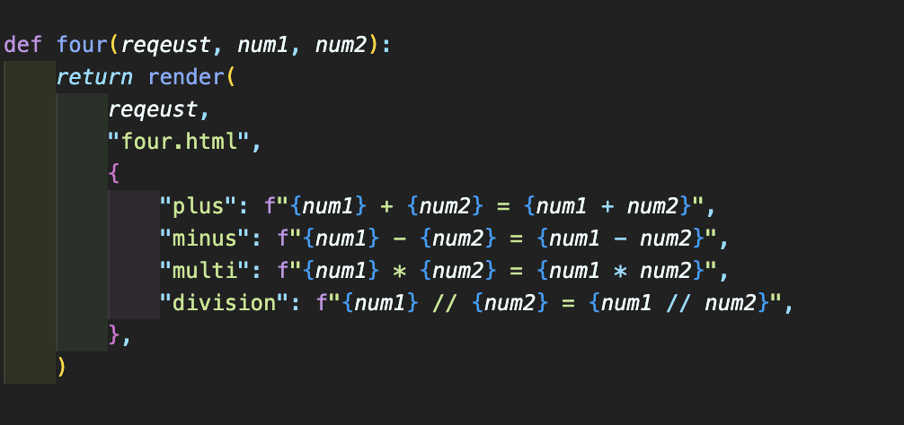

# [Django] Variable routing 📝

> 중복되는 템플릿에 일부분만 변경되는 상황에서 비슷한 URL과 템플릿을 계속해서 만들어야 할까?

- `URL 주소를 변수로 사용하는 것`을 의미
- URL의 일부를 변수로 지정하여 view 함수의 인자로 넘길 수 있음
- 변수 값에 따라 하나의 path()에 여러 페이지를 연결할 수 있음

 

## **urls.py 📙**

- path 설정할 때 `<int:변수>` 를 추가하면 `view 함수의 인자로 할당`
- `기본값은 string`

 

## **views.py 📙**

- variable routing으로 `할당된 변수를 인자로 받고, 템플릿 변수로 사용`할 수 있음
- 템플릿 변수로 사용할 때는 `"key": value 값이 있는 딕셔너리 형태`로 작성

 

## **templates/-.html 📙**

- 변수를 사용할 때에는 중괄호 안에 작성
- `{{ variable }}`

