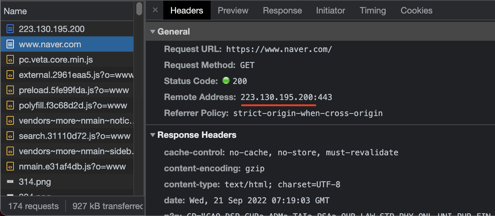
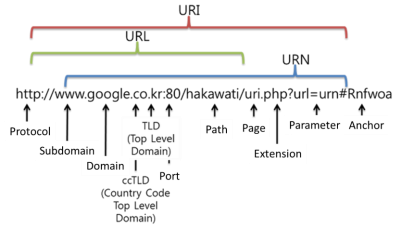
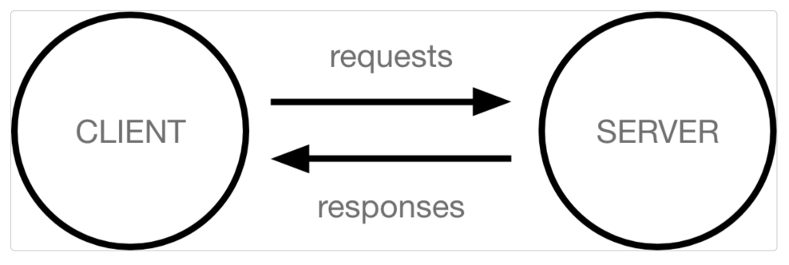

# [Django] 서버 기초 📝

 

---

## IP & 도메인 💭

> 컴퓨터는 숫자만 알아 보고, 사람은 숫자보다는 문자를 더 선호한다

 

### **IP (Internet Protocol) 📒**

> 네트워크에 접속하는 모든 기기에 부여되는 고유 번호

- 네이버 IP 주소 확인하기

 

### **도메인 (Domain) 📒**

> 12자리 숫자로 구성된 IP 주소를 사용자가 일일이 기억할 수 없기 때문에, IP 주소에 이름을 부여함

 

---

## **클라이언트와 서버 💭**

> 어떠한 자원(resource)를 달라고 요청(request)하는 쪽을 클라이언트라고 하고, 자원을 제공해주는 쪽을 서버(seever)라고 한다.

- 오늘날 우리가 사용하는 대부분의 `웹 서비스는 클라이언트 - 서버 구조를 기반으로 동작`

 

### **클라이언트 📗**

- `웹 사용자의 인터넷에 연결된 장치`
- Chrome 또는 Firefox와 같은 웹 브라우저
- `서비스를 요청하는 주체`

 

### **서버 📗**

- `웹 페이지, 사이트 또는 앱을 저장하는 컴퓨터`
- 클라이언트가 웹 페이지에 접근하려고 할 때 서버에서 클라이언트 컴퓨터로 웹 페이지 데이터를 응답해 사용자의 웹 브라우저에 표시됨
- `요청에 대해 서비스를 응답하는 주체`

 

### **HTTP (Hypertext Transfer Protocol) 📗**

- `클라이언트와 서버가 서로 통신할 수 있도록 만들어진 어플리케이션 규약`
- HTTP 메서드
  - `클라이언트가 서버에게 요청`의 목적이나 종류를 알리는 수단

 

| 메서드 | 설명                      | 비고 |
| ------ | ------------------------- | ---- |
| GET    | 리소스 조회               |      |
| POST   | 요청 데이터 처리          |      |
| PUT    | 리소스 대체 / 없으면 생성 |      |
| PATCH  | 리소스 일부 변경          |      |
| DELETE | 리소스 삭제               |      |
|        |                           |      |

 

- `응답 코드는 3자리 정수` 코드로 구성

| 응답 코드            | 설명                     | 비고 |
| -------------------- | ------------------------ | ---- |
| 100(정보)            | 요청 수신중에 있음       |      |
| 200(성공)            | 정상                     |      |
| 301(리디렉션)        | 영구적으로 주소 변경     |      |
| 307                  | 임시로 위치 이동         |      |
| 410(클라이언트 오류) | 서버에서 영구적으로 삭제 |      |
| 500(서버 오류)       | 서버 문제 발생           |      |
|                      |                          |

 

---

## **웹 페이지 💭**

> 정적 웹 페이지 + 동적 웹 페이지

 

### **Static Web page 📗**

- `있는 그대로`를 제공하는 것을 의미
- 한 번 작성된 HTML 파일의 내용이 변하지 않고 모든 사용자에게 동일한 모습으로 전달되는 것

 

### **Dynamic Web page 📗**

- `사용자의 요청에 따라` 웹 페이지에 추가적인 수정이 되어 클라이언트에게 전달되는 웹 페이지
- 서버에서 동작하고 있는 프로그램이 웹 페이지를 변경해줌

 

---

## **프레임워크 💭**

> 소프트웨어 개발에 필요한 기능들을 미리 구현해 모아놓은 것으로 개발을 보다 편리하게 해줌

- `Frame(뼈대, 틀) + Work(일하다)`
- `장점`
  - 기초부터 개발하는 비용이 없어진다
  - 검증된 코드로써 버그를 적게 생성한다
  - 유지보수가 쉬워진다
- `단점`
  - 학습이 필요하다
  - 예외적인 소스를 작업하려면 조금 복잡해지는 문제가 발생할 수 있다

 

---

## **소프트웨어 디자인 패턴 💭**

> 전 세계의 개발자들이 계속 만들다 보니 자주 사용되는 구조와 해결책이 있다는 것을 알게 되고, 건축 공법처럼 일반적인 구조화를 해둔 것을 말한다.

 

### **MVC(Model View Controller) 패턴 📗**

- 데이터 및 논리 제어를 구현하는데 널리 사용되는 소프트웨어 디자인 패턴
- 프로그램을 세가지 역할로 구분한 개발 방법론
  - `Model` : 데이터와 관련된 로직을 관리
  - `View` : 레이아웃과 화면을 처리
  - `Controller` : 명령을 model과 view 부분으로 연결

 

### **MTV(Model Template View) 패턴 📗**

> MVC 패턴을 기반으로 한 패턴이며, Django에서는 이 패턴을 사용한다.

- MVC 패턴과 크게 다른 점은 없으며, 역할에 따라 부르는 이름이 다름

| MVC        | MTV      | 설명                                                                                                         |
| ---------- | -------- | ------------------------------------------------------------------------------------------------------------ |
| Model      | Model    | - 데이터와 관련된 로직을 관리 - 응용프로그램의 데이터 구조를 정의하고 데이터베이스의 기록을 관리        |
| View       | Template | - 레이아웃과 화면을 처리 - 화면상의 사용자 인터페이스 구조와 레이아웃을 정의                            |
| Controller | View     | - Model & Template과 관련된 로직을 처리해서 응답을 반환 - 클라이언트의 요청에 대해 처리를 분기하는 역할 |
|            |          |

 

---

#### **참조 📚**

- 클라이언트와 서버가 궁금하다면 [클릭](https://developer.mozilla.org/ko/docs/Learn/Getting_started_with_the_web/How_the_Web_works)

- 정적 웹사이트와 동적 웹사이트가 궁금하다면 [클릭](https://developer.mozilla.org/ko/docs/Learn/Server-side/First_steps/Introduction)
