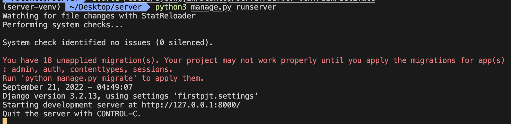
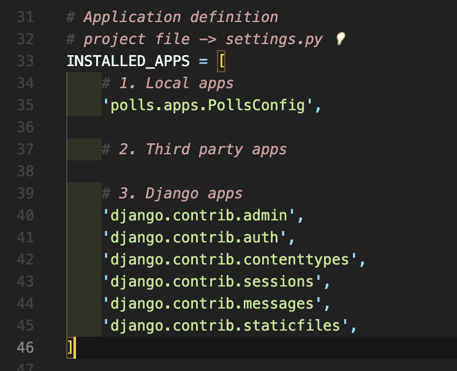

# [Django] 장고 시작하기 📝

> 웹 서비스를 만들 수 있는 인기 Frame Work(일정한 틀을 가지고 일을 하게 됨) 중 하나로 생산성과 품질을 높이게 됨

<br />

## Django 시작하기 💭

> Python이 이미 설치되어 있다고 가정하고, Mac을 기준으로 작성했습니다.

<br />

### **1. 가상 환경 생성 📗**

```bash
python -m venv 가상환경이름
```

<br />

### **2. 가상 환경 진입 📗**

- 가상환경 비활성화
  - `deactivate` 입력

```bash
source 가상환경이름/bin/activate

# 진입 후 확인
(가상환경이름) $ 입력창
```

<br />

### **3. Django 설치 📗**

> Django는 3년마다 LTS(Long Term Support)를 위해 메이저 버전을 올리고, 8개월마다 마이너 버전을 올립니다. 현재 LTS 버전은 3.2.x 입니다.

- 버전을 명시하지 않을 경우 최신 버전으로 설치
- 설치 후 확인하기
  - `python -m django --version` 입력

```bash
# 최신 버전
pip install django

# 지정 버전
pip install django==3.2.13
```

<br />

### **4. Django 프로젝트 생성 📗**

- 경로지정을 생략하면 현재 폴더 내에 생성
- 만들어진 프로젝트 파일 내에서 모든 개발 과정이 이루어짐

```bash
django-admin startproject 프로젝트이름 (경로지정)

# 또는
python -m django startproject 프로젝트이름 (경로지정)
```

<br />

### **5. Django 프로젝트 서버 실행 📗**

- 서버 종료하기
  - `Control + C`

```bash
python manage.py runserver
```

- 서버 접속하기
  - `https://127.0.0.1:8000/`
  - 주소창에 입력 또는 `쉘에서 Control + 주소 클릭`
  - 여기서
    - 127.0.0.1 = 자기 자신의 IP주소
    - 호스트네임 = locallhost



<br />

### **6. Django 앱 생성 📗**

- 생성 후 해당 폴더가 생성되었는지 확인
- 일반적으로 `앱 이름은 복수형`으로 작성

```bash
python manage.py startapp 앱이름
```

<br />

---

## **INSTALLED_APPS 💭**

> 프로젝트에서 앱을 사용하기 위해서는 반드시 INSTALLED_APPS 리스트에 반드시 추가해야 합니다.

- Django installation에 `활성화된 모든 앱을 지정하는 문자열 목록`



<br />

---

## **Project & Application 💭**

| Project                                                                                         | Application                                                                                                                 |
| ----------------------------------------------------------------------------------------------- | --------------------------------------------------------------------------------------------------------------------------- |
| - 프로젝트는 엡의 집합<br />- 여러 앱이 포함될 수 있음<br />- 앱은 여러 프로젝트에 있을 수 있음 | - 실제 요청을 처리하고 페이지를 보여주는 등의 역할을 담당<br />- 일반적으로 하나의 역할 및 기능 단위로 작성하는 것을 권장함 |
|                                                                                                 |                                                                                                                             |

<br />

---

#### **참조 📚**

- 장고 공식 문서가 궁금하다면 [클릭](https://www.djangoproject.com/)
