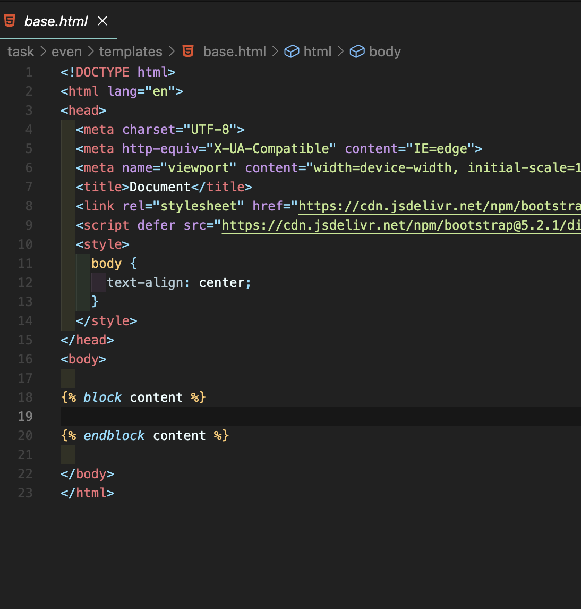
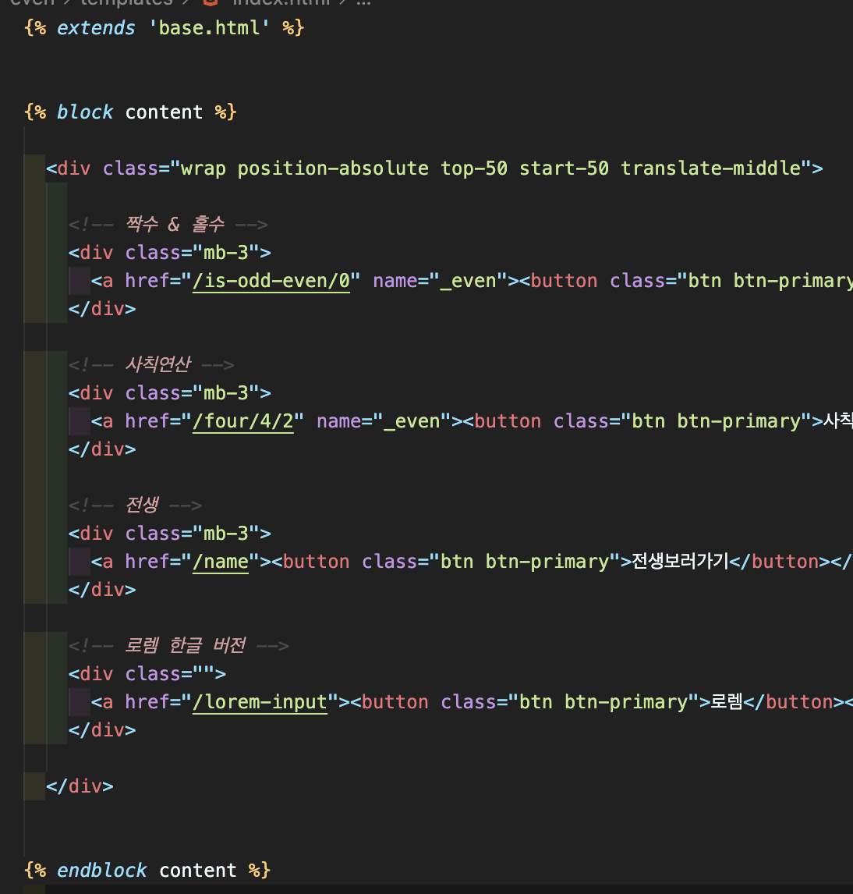
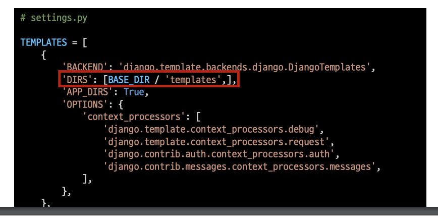
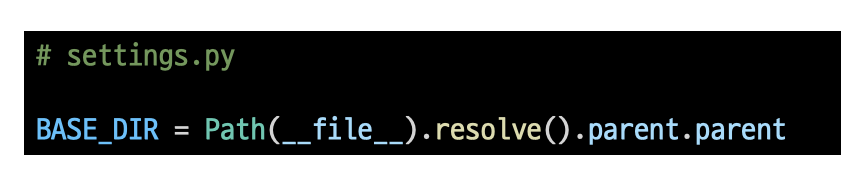

# [Django] Template inheritance 📝

> 만약 모든 템플릿에 부트스트랩을 적용하려면 어떻게 해야 할까?

- 템플릿 상속은 기본적으로 코드의 재사용성에 초점을 맞춤
- 템플릿 상속을 사용하면 사이트의 모든 공통 요소를 포함하고, 하위 템플릿이 재정의(override)할 수 있는 블록을 정의하는 기본 'skeleton' 템플릿을 만들 수 있음

 

## **상속 관련 태그 💭**

### **base.html 📘**

- 부모 템플릿으로 사용할 html 지정
- `자식 템플릿이 사용할 수 있도록 block을 설정 `

### ** 📘**

- 자식 템플릿이 부모 템플릿을 확장한다는 것을 알림
- 반드시 `템플릿 최상단에 작성되어야 함 (2개 이상 사용 불가)`

 

### ** 📘**

- `하위 템플릿에서 재정의할 수 있는 블록을 정의`
- 가독성을 높이기 위해 선택적으로 endblock 태그에 이름을 지정할 수 있음

 

## **추가 템플릿 경로 추가하기 💭**

> 앱 안의 template 디렉토리가 아닌 프로젝트 최상단의 templates 디렉토리 안에 위치하고 싶다면 어떻게 해야 할까?

- 특정 경로를 절대 경로로 편하게 작성할 수 있도록 Django에서 미리 지정해둔 경로 값
- `객체 지향 파일 시스템 경로`
  - 운영체제별로 파일 경로 표기법이 다르기 때문에 어떤 운영체제에서 실행되더라도 각 운영체제 표기법에 맞게 해석될 수 있도록 하기 위해 사용
  - 자세한 내용이 궁금하다면 [클릭](https://docs.python.org/ko/3.9/library/pathlib.html#module-pathlib)

