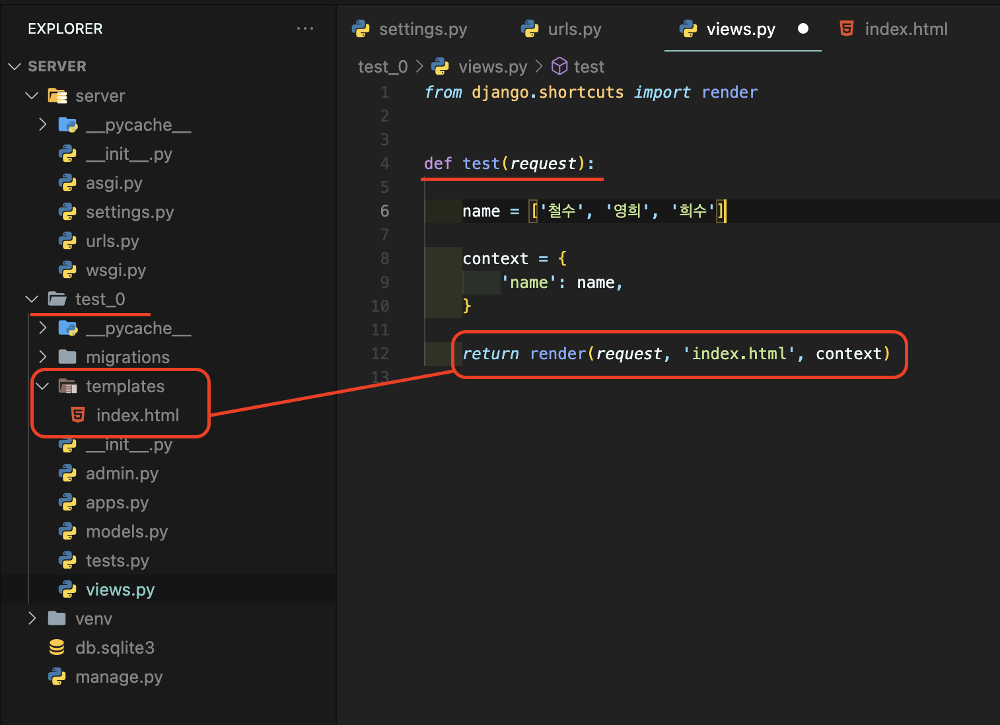

# [Django] 요청과 응답 📝

> 정해진 순서는 없지만, URL -> VIEW -> TEMPLATE 순으로 작성하면서 데이터의 흐름을 이해하는 것이 중요!

 

## **URLS 💭**

`'test/'` -> 아래 사진과 같이 경로가 설정이 됩니다.

 

---

## **VIEWS 💭**

> HTTP 요청을 수신하고 HTTP 응답을 반환하는 함수를 작성하게 됨

 

### **render() 📒**

- 주어진 템플릿을 주어진 컨텍스트 데이터와 결합하고 렌더링된 텍스트와 함께 HttpRespnse(응답) 객체를 반환하는 함수
- `render(request, template_name, context)`

| 명칭          | 내용                                             | 비고 |
| ------------- | ------------------------------------------------ | ---- |
| request       | 응답을 생성하는 데 사용되는 요청 객체            |      |
| Template_name | 템플릿의 전체 이름 또는 템플릿 이름의 경로       |      |
| context       | 템플릿에서 사용할 데이터(딕셔너리 타입으로 작성) |      |
|               |                                                  |      |

 

---

## **Templates 💭**

- 실제 내용을 보여주는데 사용되는 파일
- 파일의 구조나 레이아웃을 정의
- 기본 파일 경로 `app_name/templates/`

 

---

## **추가 설정 💭**

 

### **LANGUAGE_CODE 📘**

> 모든 사용자에게 제공되는 번역을 결정

- 이 설정을 적용하려면 USE_I18N이 활성화(True)되어 있어야 함

 

### **TIME_ZONE 📘**

> 데이터베이스 연결의 시간대를 나타내는 문자열 지정

- USE_TZ이 True이고, 이 옵션이 설정된 경우 데이터베이스에서 날짜 시간을 읽으면, UTC 대신 새로 설정한 시간대의 인식 날짜 & 시간이 반환됨

 

### **USE_I18N 📘**

- Django 번역 시스템을 활성화해야 하는지 여부를 지정

 

### **USE_L10N 📘**

- 데이터의 지역화된 형식을 기본적으로 활성화할지 여부를 지정
- True일 경우, Django는 현재 locale의 형식을 사용하여 숫자와 날짜를 표시

 

### **USE_TZ 📘**

- datetimes가 기본적으로 시간대를 인식하는지 여부를 지정
- True일 경우 Django는 내부적으로 시간대 인식 날짜 / 시간을 사용
