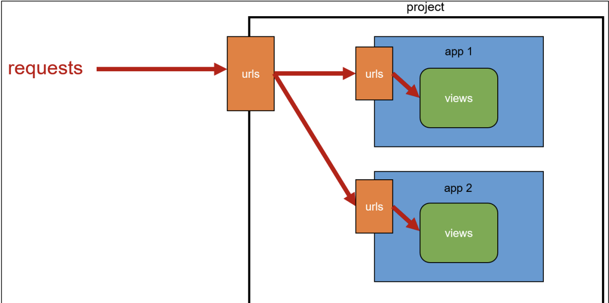

# [Django] App URL mapping 📝

> app의 view함수가 많아지면 사용하는 path() 또한 많아지기 때문에 프로젝트의 urls.py에서 모두 관리하는 것은 유지보수에 좋지가 않다.

<br />

```python
# project1/urls.py
# 프로젝트 urls.py에서 모두 관리할 수 있지만.. 더 좋은 방법은💡

from appname1 import views as appname1_views
from appname2 import views as appname2_views

urlpatterns = [
	...,
path('pages-index', pages_views.index),
]

```

<br />

## **1. 각자의 app 폴더 안에서 url.py 파일을 생성 💭**

```python
# artcles/urls.py

from django.urls import path
from . import views

urlpatterns = [
  path('index/', views.index),
  path('greeting/', views.greeting),
  path('dinner/', views.dinner),
  path('catch/', views.catch),
]
```

<br />

## **2. Including other URLconfs 💭**

- `include()` : 다른 URLconf들을 참조할 수 있도록 돕는 함수

```python
# project1/urls.py
# include 불러오기

from django.contrib import admin
from django.urls import path, include

urlpatterns = [
  path('admin/', admin.site.urls),
  path('articles/', include('articles.urls')),
  path('pages/', include('pages.urls')),
]
```

<br />

## **3. URL 구조 변화 과정 💭**


