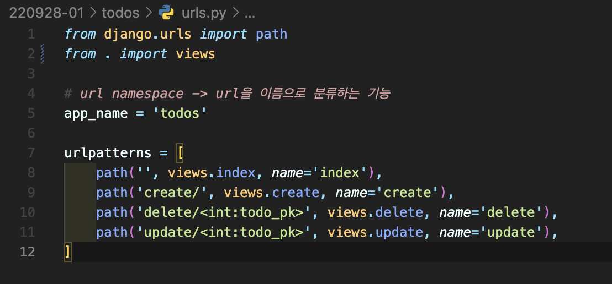
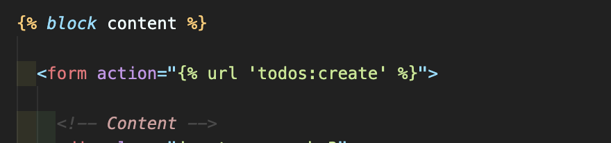

# [Django] URL namespace 📝

> URL namespace를 사용하면 서로 다른 앱에서도 동일한 URL 이름을 사용할 수 있다!

<br />

## **URL namespace 💭**

```python
# articles/urls.py
app_name = 'articles'
urlpatterns = [
  ...,
]

# pages/urls.py
app_name = 'pages'
urlpatterns = [
  ...,
]
```

⁉ app_name을 지정한 이후에는 `app_name:url_name` 형태로 사용해야 합니다.

⁉️ 그렇지 않으면 `NoReverceMatch 에러` 발생 ‼️

```html
<!-- articles/templates/index.html -->

 
<h1>:연산자를 사용한다</h1>
<a href="">URL namespace 사용하기</a>

```

<br />

---

# [Django] Naming URL patterns 📝

> URL 변경이 필요할 때, 모든 URL을 찾아서 변경해야 하는 번거로움을 해결할 수 있다!

<br />

## **Naming URL patterns 💭**

- `Path() 함수에 name 인자를 정의`해서 사용



- template에서는 ``



<br />

## **DRY(Don't Repeat Yourself) 원칙 💭**

> 소스 코드에서 동일한 코드를 반복하지 말자!

1. `"표현과 로직(view)을 분리"`
   - 템플릿 시스템은 표현을 제어하는 도구이자 표현에 관련된 로직일 뿐이다.
   - 템플릿 시스템은 기본 목표를 넘어서는 기능을 지원하지 말아야 한다.
2. `"중복을 배제"`
   - 대다수의 템플릿 시스템은 이러한 요소를 한 곳에 저장하기 쉽게 하여 중복 코드를 업애야 한다.

<br />

---

# [Django] Database 📝

> 검색 및 구조화 같은 작업을 보다 쉽게 하기 위해 조직화된 데이터를 수집하는 저장 시스템

<br />

## **스키마(Schema) 💭**

- `뼈대(Structure)`
- 데이터베이스에서 `자료의 구조, 표현 방법, 관계 등을 정의`한 구조

<br />

## **테이블(Table) 💭**

- 필드와 레코드를 사용해 조직된 `데이터 요소들의 집합`
- 관계(Relation)라고도 함

<br />

### **필드(Field) 📙**

- `속성, 컬럼(Column)`
- 각 필드에는 고유한 데이터 형식이 지정됨

<br />

### **레코드(Record)📙**

- 튜플, 행(Row)
- `테이블의 데이터를 저장`

<br />

### **PK(Primary Key) 📙**

- `각 레코드의 고유한 값(식별자로 사용)`

<br />

### **쿼리(Query) 📙**

- 데이터를 조회하기 위한 명령어
- 조건에 맞는 데이터를 추출하거나 조작하는 명령어
- `"Query를 날린다." -> "DB를 조작한다."`
