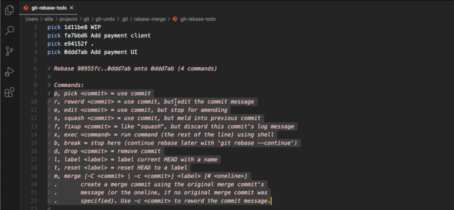

# [Git] 여러 개의 커밋 수정하기

> ## **rebase**

- 머지와 동일하게 병합할 수 있지만 `필요한 커밋만` 남길 수 있어서 커밋이 깔끔하다는 장점이 있음

```sh
# 지정한 코드부터 뒤에 이어지는 아이들까지
git rebase -i 수정코드

또는

# 헤드부터 n번째까지
git rebase -i HEAD~n
```

<br />

#### **실행하고 나면 아래 화면이 💭**

- `pick` 을 아래 적힌 명령어로 교체하기
  - `reword` : 메세지 변경
  - `edit` : 변경 사항을 바꿈
  - `squash` : 하나로 묶음
  - `fixup` : 메세지를 남기지 않고 묶음
  - `break` : 멈춤
  - `drop` : 제거
- 참고로 단축해서 앞자만 사용 가능
  - reword = r
  - squash = s
  - ...
- 다 끝났으면 `저장하고 종료`
  - 종료하면 `커밋 메세지를 수정`하라고 나오는데 남길 메세지 하나만 남기거나 혹은 수정하고 다시 저장
- 원격 저장소도 같이 수정해야 한다면 💡
  - 강제로 푸시 옵션은 `git push -f origin master`



<br />
