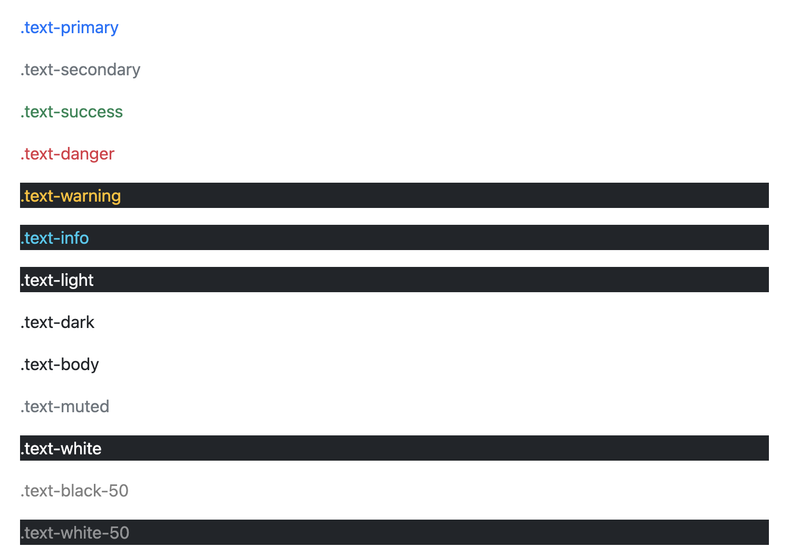
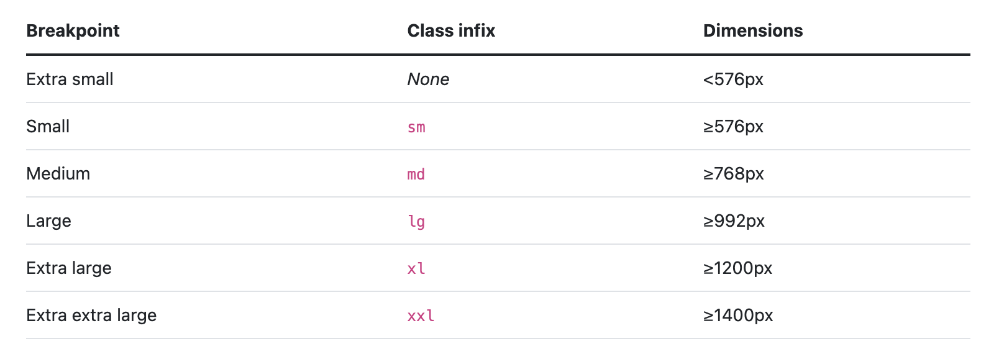

# [HTML] 부트스트랩 📝

<br />

## **Bootstrap 💭**

> 반응형이며 모바일 우선인 웹프로젝트 개발을 위한 HTML, CSS, JS 프레임워크

- CSS, JS 파일을 미리 만들어 놓고 사용하기 때문에 웹페이지를 제작할 때 코드의 양을 줄여줌
- 다운로드 또는 CDN 방식으로 링크 사용

<br />

### **CDN이란 무엇일까 💡**

- Content Delivery(Distribution) Network
- 컨텐츠(CSS, JSm Image, Text 등)을 효율적으로 전달하기 위해 여러 노드에 가진 네트워크에 데이터를 제공하는 시스템
- 개별 end-user의 가까운 서버를 통해 빠르게 전달 가능(지리적 이점)
  - 외부 서버를 활용함으로써 본인 서버의 부하가 적어짐

<br />

### [부트스트랩 시작하기](https://getbootstrap.com/docs/5.2/getting-started/introduction/)

<br />

---

# [Bootstrap] 간격 📝

<br />

## **spacing 💭**

- 클래스 형식 : `{property}{sides}-{size}`

<br />

### **property**

| 속성 | 내용    |
| ---- | ------- |
| m    | margin  |
| p    | padding |
|      |         |

<br />

### **sides**

| 측면 | 내용        |
| ---- | ----------- |
| t    | top         |
| b    | bottom      |
| s    | left        |
| e    | right       |
| x    | Left, right |
| y    | top, bottom |
|      |             |

<br />

### **size**

| 크기 | rem  | px  |
| ---- | ---- | --- |
| 0    | 0    | 0   |
| 1    | 0.25 | 4   |
| 2    | 0.5  | 8   |
| 3    | 1    | 16  |
| 4    | 1.5  | 24  |
| 5    | 3    | 48  |
|      |      |

<br />

### **예시**

```css
.mt-0 {
  margin-top: 0 !important;
}

.ms-1 {
  margin-left: ($spacer * 0.25) !important;
}

.px-2 {
  padding-left: ($spacer * 0.5) !important;
  padding-right: ($spacer * 0.5) !important;
}

.p-3 {
  padding: $spacer !important;
}
```

<br />

## **수평 센터링 💭**

- `mx-auto` : 수평 가운데 정렬
- 너비 설정

```html
<div class="mx-auto" style="width: 200px">Centered element</div>
```

<br />

---

# [Bootstrap] 색상 📝

<br />

## **Colors 💭**

- 클래스 형식 : `text-{color}, bg-color, link-color`



<br />

### **예시**

```html
<p class="text-primary">text-primary</p>
```

<br />

---

# [Bootstrap] 텍스트 📝

<br />

## **Text 💭**

- 클래스 형식 : `text-{property}`

| 속성       | 내용                 |
| ---------- | -------------------- |
| start      | 왼쪽 정렬            |
| center     | 가운데 정렬          |
| end        | 오른쪽 정렬          |
| wrap       | 줄 바꿈              |
| lowercase  | 소문자 변환          |
| uppercase  | 대문자 변환          |
| capitalize | 앞글자만 대문자 변환 |
|            |                      |

<br />

## **font size 💭**

- 클래스 형식 : `fs-{size}`
- `사이즈(1~6)`에 따라 `제목 클래스 적용(h1~h6)`

<br />

## **font weight & italics 💭**

- 클래스 형식 : `fw-{weight}, fst-{italic}`

| 두께     | 내용      |
| -------- | --------- |
| bolder   | 더 굵은   |
| bold     | 굵은      |
| semibold | 반 굵은   |
| normal   | 일반      |
| light    | 가벼운    |
| lighter  | 더 가벼운 |
| Italic   | 기울임    |
|          |           |

<br />

## **Line height 💭**

- 클래스 형식 : `1h-{height}`

| 높이 | 내용    |
| ---- | ------- |
| 1    | 더 좁은 |
| sm   | 좁은    |
| base | 기본    |
| lg   | 넓은    |
|      |         |

<br />

---

# [Bootstrap] 중단점 📝

<br />

## **Breakpoints 💭**

> 뷰포트 크기에 따라 레이아웃 응답이 어떻게 변경되는지에 대한 트리거

- 반응형 디자인의 빌딩 블록이다.
- 미디어 쿼리를 사용하여 중단점으로 CSS를 설계한다.
- 모바일 우선, 반응형 디자인이 목표이다.

<br />



<br />

---

# [Bootstrap] 디스플레이 📝

## **display 💭**

- 클래스 형식 : `.d-{value}`
- (미디어 쿼리) 클래스 형식 : `.d-{breakpoint}-{value}`

| 속성         | 내용          |
| ------------ | ------------- |
| none         | 요소 숨김     |
| inline       | 인라인        |
| Inline-block | 인라인블록    |
| block        | 블록          |
| grid         | 그리드        |
| table        | 테이블        |
| flex         | 플렉스        |
| Inline-flex  | 인라인 플렉스 |
|              |               |

<br />

---

# [Bootstrap] 배경 📝

- `%` : 10, 25, 50, 75

| 효과            | 클래스                  |
| --------------- | ----------------------- |
| 배경색          | .bg-{color}             |
| 배경 그라데이션 | .bg-{color}.bg-gradient |
| 불투명도        | .bg-opacity-{%}         |
|                 |                         |

<br />

---

# [Bootstrap] 테두리 📝

- `size` : 0, 1, 2, 3, 4, 5
- `way` : top, bottom, start, end

| 효과               | 클래스                        |
| ------------------ | ----------------------------- |
| 테두리 넣기        | .border<br />.border-{way}    |
| 테두리 빼기        | border-0<br />.border-{way}-0 |
| 테두리 색상        | .border-{color}               |
| 테두리 굵기        | .border-{size}                |
| 테두리 반지름      | .rounded<br />.rounded-{way}  |
| 테두리 반지름 크기 | .rounded-{size}               |
|                    |                               |

<br />

---

# [Bootstrap] 플렉스 📝

## **flex 💭**

- 활성화 : d-flex

- CSS 속성과 비슷한 점이 많음

- 자세한 내용이 궁금하다면 [클릭](https://getbootstrap.com/docs/5.2/utilities/flex/)

  <br />

---

# [Bootstrap] 넘침 📝

## **overflow 💭**

- overflow-{value}

| 속성    | 내용                                      |
| ------- | ----------------------------------------- |
| auto    | 자동                                      |
| hidden  | 넘치는 부분을 가림                        |
| visible | 기본값 / 넘치는 컨텐츠가 상자 밖으로 보임 |
| scroll  | 스크롤바 추가                             |
|         |                                           |

<br />

---

# [Bootstrap] 포지션 📝

## **position 💭**

- CSS 속성과 비슷한 점이 많음
- 자세한 내용이 궁금하다면 [클릭](https://getbootstrap.com/docs/5.2/utilities/position/)

<br />

---

# [Bootstrap] 그림자 📝

## **shadows 💭**

- shadow-{value}

| 속성 | 내용 |
| ---- | ---- |
| none | 없음 |
| sm   | 작은 |
| -    | 중간 |
| lg   | 큰   |
|      |      |

#### **참조 📚**

- 미디어 쿼리 공식 문서 [클릭](https://developer.mozilla.org/en-US/docs/Web/CSS/Media_Queries/Using_media_queries)
