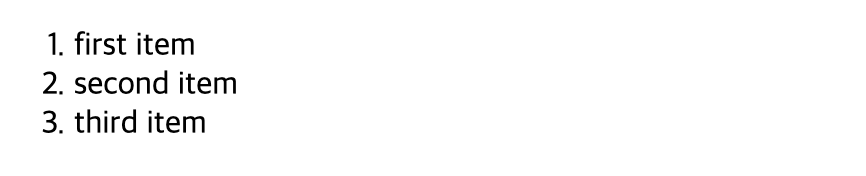
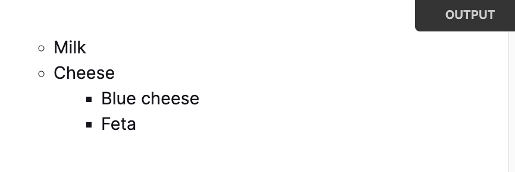
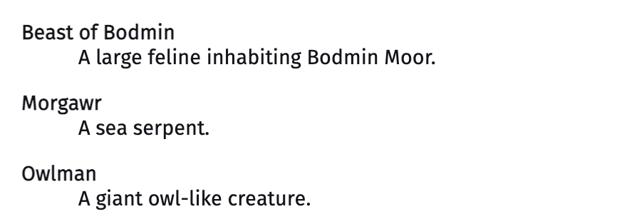
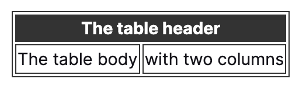

# [HTML] 목록 태그 모음 📝

> 목록끼리도 중첩으로 사용할 수 있습니다.

<br />

## **순서가 있는 목록 (ordered list) 💭**



- `reversed` : 순서 역전 여부
- `start`: 시작 번호
- `type` : 항목을 셀 카운터 유형 (기본값은 1)
  - a : 소문자
  - A : 대문자
  - i : 소문자 로마
  - I : 대문자 로마
  - 1 : 숫자

```html
<!-- 소문자로 카운팅 -->
<ol type="a">
  <li>first item</li>
  <li>second item</li>
</ol>

<!-- 3부터 시작 -->
<ol start="3">
  <li>first item</li>
  <li>second item</li>
</ol>

<!-- 중첩 사용하기 -->
<ol>
  <li>first item</li>
  <li>second item</li>
  <ol>
    <li>second item - first</li>
    <li>second item - second</li>
  </ol>
</ol>
```

<br />

---

## **순서가 없는 목록 (unordered list) 💭**



```html
<ul>
  <li>first item</li>
  <li>second item</li>
</ul>
```

<br />

---

## **설명 목록 💭**



```html
<dl>
  <dt>이름</dt>
  <dd>설명</dd>
</dl>
```

<br />

---

## **테이블 목록 💭**



```html
<table>
  <tr>
    <td>1행 1열</td>
    <td>1행 2열</td>
  </tr>
  <tr>
    <td>2행 1열</td>
    <td>2행 2열</td>
  </tr>
</table>
```
