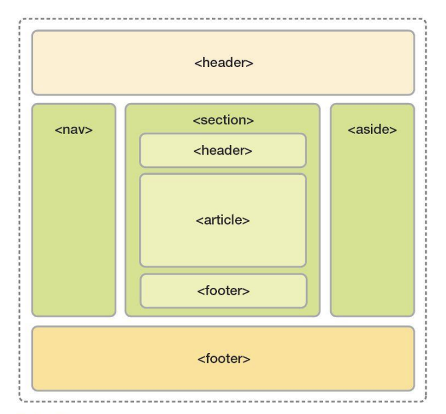

# HTML 태그 모음 & 요약 정리

```html
<!DOCTYPE html> 🔸 웹 문서 유형을 html으로 지정
<html lang="ko">
  🔸 언어는 한국어로
  <head>
    🔸 웹 정보를 정의
    <meta charset="UTF-8" />
    🔸 메타 데이터 입력
    <title>Document</title>
    🔸 문서의 제목
  </head>
  <body>
    🔸 문서 내용 입력은 여기에 !
  </body>
</html>
```

<br />

> ### 레이아웃

<br />



```
<header>  🔸  문서의 머리말 영역 표시
<nav>  🔸  웹 안에서 분류된 다른 영역으로 이동할 때 사용
<main>  🔸  메인 영역
<section>  🔸  문서의 콘텐츠 영역
<aside>  🔸  주요 콘텐츠 외 남은 콘텐츠 표시
<footer>  🔸  사이트의 자세한 정보를 표시
```

<br />

> ### 텍스트

- 관련 태그가 궁금하다면 [클릭](./tag-text.md)

<br />

> ### 목록

- 관련 태그가 궁금하다면 [클릭](./tag-list.md)

<br />

> ### 이미지 삽입

- ``
- 관련 속성이 궁금하다면 [클릭](https://developer.mozilla.org/ko/docs/Web/HTML/Element/img)

<br />

> ### 오디오, 비디오 삽입

- `<audio src="오디오 파일 경로"</audio>`
- `<video src="비디오 파일 경로"></video>`
- 오디오 속성이 궁금하다면 [클릭](https://developer.mozilla.org/ko/docs/Web/HTML/Element/audio)
- 비디오 속성이 궁금하다면 [클릭](https://developer.mozilla.org/ko/docs/Web/HTML/Element/Video)

<br />

> ### 하이퍼링크 삽입

- `<a href="링크할 주소">텍스트 또는 이미지</a>`

<br />

> ### 폼 삽입

- `<form 속성="속성값">폼 입력 요소들</form>`
- 폼 요소가 궁금하다면 [클릭](https://developer.mozilla.org/ko/docs/Web/HTML/Element/form)
- 입력 요소가 궁금하다면 [클릭](https://developer.mozilla.org/ko/docs/Web/HTML/Element/Input)

<br />

> ### 참조

- HTML 요소 참고 문헌 (MDN) [클릭](https://developer.mozilla.org/ko/docs/Web/HTML/Element)
