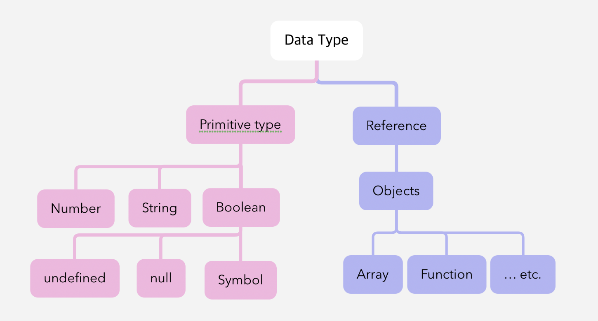

# [JS] 문법과 자료형 📝

## **기본 💭**

<br />

### **세미콜론(;)**

- 명령문이 한 줄을 차지하는 경우 필요하지 않음
  - 한 줄에 두 개 이상의 명령문이 들어가는 경우 반드시 세미콜론으로 구분
- But, 필요하지 않은 경우라도 항상 세미콜론으로 끝마치는 것이 버그 예방 차원에서도 좋은 습관!!

<br />

### **주석(//)**

```javascript
// 한 줄 주석

/* 
	긴 줄  
	주석 
*/
```

<br />

## **선언 💭**

| 변수 선언 | 내용                                                 | 비고 |
| --------- | ---------------------------------------------------- | ---- |
| var       | - 변수 선언<br />- 지금은 사용하지 않음              |      |
| let       | - 블록 스코프 지역 변수 선언<br />- 변경 가능        | 👍   |
| const     | - 블록 스코프 읽기 전용 상수 선언<br />- 변경 불가능 | 👍   |
|           |                                                      |

<br />

### **var를 사용하지 않는 이유**

- `var hoisting` : 어디에 선언되었든 관계없이 항상 선언을 제일 위로 끌어올림
- `no block scope` : 블록 스코프 불가능

<br />

### **변수명**

- `문자, 밑줄(_), 달러 기호($)로 시작`하며, `이후에는 숫자도 사용`가능하다.

<br />

### **변수 스코프**

| 스코프        | 설명                                                                                                                         | 비고 |
| ------------- | ---------------------------------------------------------------------------------------------------------------------------- | ---- |
| 블록 스코프   | - 함수 내부에서 선언한 변수<br />- 함수 밖에서는 변수 사용 불가                                                              |      |
| 글로벌 스코프 | - 함수 밖에서 선언한 변수<br />- 어디서든 변수 사용 가능 <br />- 항상 메모리에 탑재되기 때문에 최소한으로 사용하는 것이 좋다 |      |
|               |                                                                                                                              |      |

<br />

---

# [JS] 데이터 구조 및 타입 📝

## **데이터 타입 💭**

- 자바스크립트의 모든 값은 특정한 데이터 타입을 가짐
- 크게 `원시 타입 (Primitive type)`과 `참조 타입 (Reference type)`으로 분류됨
  

<br />

### **원시 타입 (Primitive type)**

- `객체 (object)가 아닌 기본 타입`
- 변수에 해당 타입의 값이 담김
- 다른 변수에 복사할 때 실제 값이 복사됨

<br />

### **참조 타입 (Reference type)**

- `객체 (object) 타입의 자료형`
- 변수에 해당 객체의 참조 값이 담김
- 다른 변수에 복사할 때 참조 값이 복사됨

<br />

| 형        | 설명                               | 비고 |
| --------- | ---------------------------------- | ---- |
| Boolean   | Ture & false                       |      |
| null      | null                               |      |
| undefined | 값이 정의되지 않은 최상위 속성     |      |
| Number    | 정수 또는 실수                     |      |
| BigInt    | 큰 정수<br />- 숫자 마지막에 n     |      |
| String    | 문자열                             |      |
| Symbol    | 인스턴스가 고유한 불변의 데이터 형 |      |
|           |                                    |

<br />

### **숫자 (Number) 타입**

- 정수, 실수 구분 없는 하나의 숫자 타입
- 부동소수점 형식을 따름

```javascript
const a = 13; // 양의 정수
const b = -5; // 음의 정수
const c = 3.14; // 실수
const d = 2.998e8; // 거듭제곱
const e = Infinity; // 양의 무한대
const f = -Infinity; // 음의 무한대
const g = NaN; // 산술 연산 불가
```

<br />

### **문자열 (String) 타입**

- 텍스트 데이터를 나타내는 타입
- 16비트 유니코드 문자의 집합
- 작은따옴표 또는 큰따옴표 모두 가능

```javascript
const firstName = "Brandan";
const lastName = "Eich";
const fullName = `${firstName} ${lastName}`;

console.log(fullName); // Brandan Eich
```

<br />

### **undefined**

- 변수의 값이 없음을 나타내는 데이터 타입
- 변수 선언 이후 직접 값을 할당하지 않으면, 자동으로 undefined가 할당됨

<br />

### **null**

- 변수의 값이 없음을 나타내는 데이터 타입
- 변수 선언 이후 직접 값을 할당하지 않으면, 자동으로 undefined가 할당됨

```javascript
let firstName = null;
console.log(firstName); // null

typeof null; // object
```

<br />

### **Boolean 타입**

- 논리적 참 또는 거짓을 나타내는 타입
- true 또는 false로 표현
- 조건문 또는 반복문에서 유용하게 사용

<br />

```javascript
// Variable types 📝
// primitive, single item: number, string, boolean, null, undefined, symbol

const count = 17; // integer 💭
const size = 17.1; // decimal number 💭

// number - spcicla numeric values: infinity, -infinity, NaN 💭
const infinity = 1 / 0;
const negativeInfinity = -1 / 0;
const nAn = 'not a number' / 2;


// string 💭
const char = 'c';
const brendan = 'brendan';
const greeting = 'hello' + brendan;
const helloBob = `hi ${brendan}!`; // template literals (string) -> python : f''string
console.log(`hi ${helloBob}, type: ${typeof helloBob}`);


// boolean 💭
// false: 0, null, undefined, NaN, ''
// true: any other value
const canRead = true;
const test = 3 < 1; // false


// null 💭
let nothing = null;


// undefined 💭
let x = undefined;
let x;


// symbol, create unique identifiers for objects 💭
const symbol1 = Symbol('id');
const symbol2 = Symbol('id');
console.log(symbol1 === symbol2); // false

const gSymbol2 = Symbol.for('id');
const gSymbol1 = Symbol.for('id');
console.log(gSynbol1 == gSynbol2); // true
// 심볼을 출력하려면 .description을 붙여서 string으로 변환해야 한다. 💡
console.log(`value: ${symbol1.description}, type: ${typeof: symbol1.description}`);


// Dynamic typing: dynamically typed language 💡
let text = 'hello'; // string
text = 1; // number
text = '7' + 5; // string
text = '8' / '2'; // number

```

<br />

---

#### **참조 📚**

- 자세한 내용이 궁금하다면 [클릭](https://developer.mozilla.org/ko/docs/Web/JavaScript/Guide/Grammar_and_types)
