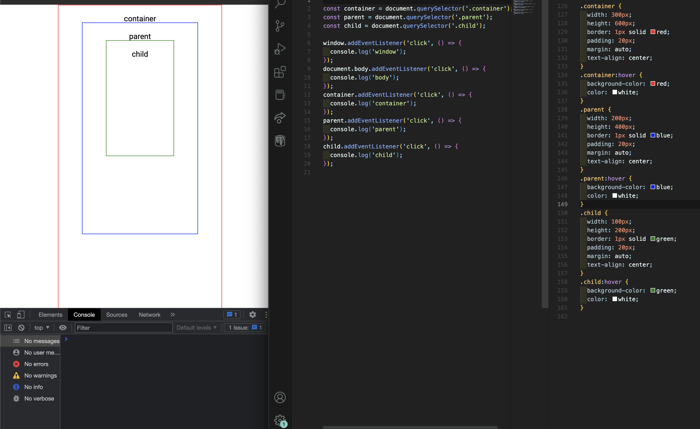
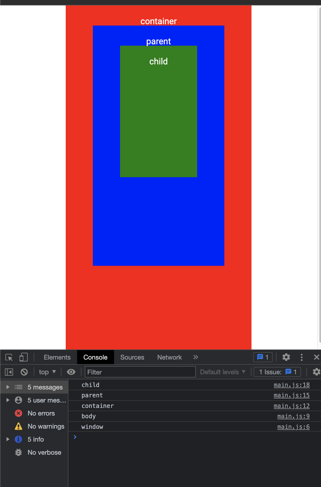
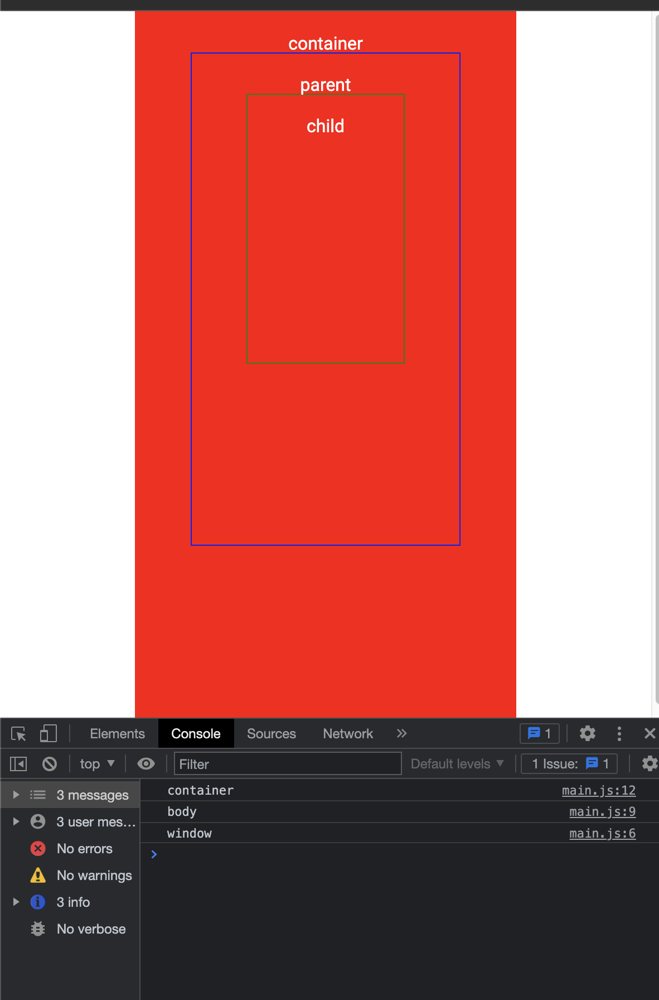
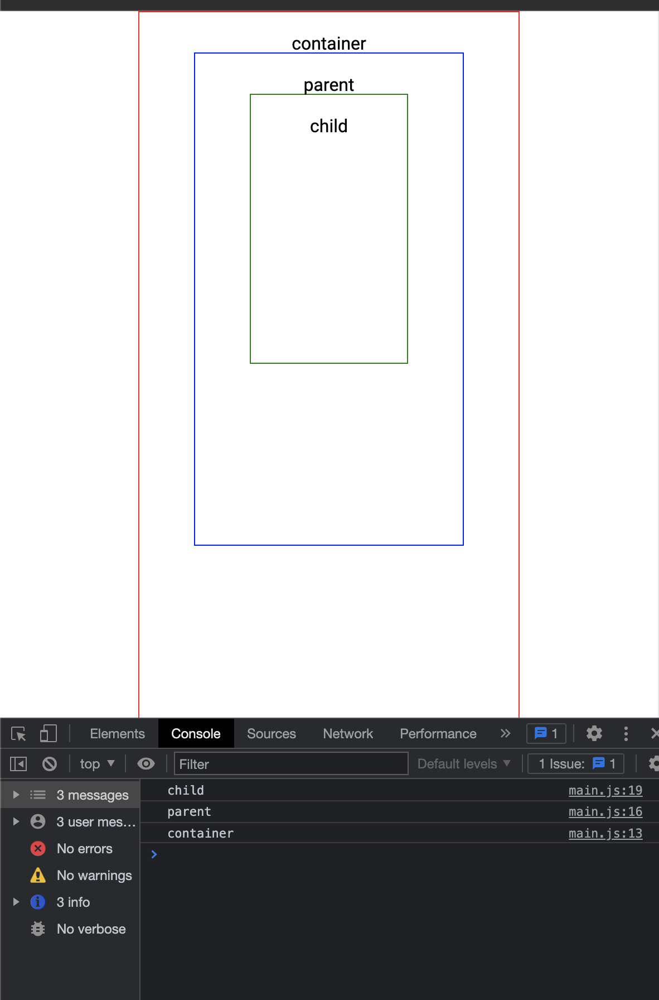

# Event

[Event reference | MDN](https://developer.mozilla.org/en-US/docs/Web/Events)

## Capturing and Bubbling

한 요소에 이벤트가 발생하면 해당 이벤트 요소를 찾아가고(Capturing), 해당 요소부터 조상 요소까지 돌아가는 과정에서 핸들러를 발생(Bubbling)하게 됩니다.


## Event Bubbling



> 자식 요소를 클릭하면 부모 요소부터 윈도우까지 모두 실행하게 되고, 컨테이너를 클릭하면 그 위에 바디부터 윈도우까지 실행하는 모습을 볼 수 있다.




### event stop

```jsx
// 버블링 중간에 이벤트를 멈춤으로써 container까지만 실행하고 멈추게 된다.
container.addEventListener('click', (e) => {
  e.stopPropagation();
  console.log('container');
});
```



## Event delegation

요소마다 핸들러를 할당하지 않고 **공통된 부모 요소에만 할당하여 여러 요소를 한번에** 다루게 됩니다.

```javascript
// BAD❌
const lis = document.querySelectorAll('li');
lis.forEach((li) => {
  li.addEventListener('click', () => {
    li.classList.add('selected');
  });
});

// GOOD👍
const ul = document.querySelector('ui');
ul.addEventListener('click', (event) => {
  if (event.target.tagName == 'LI') {
    event.target.classList.add('selected');
  }
});
```
