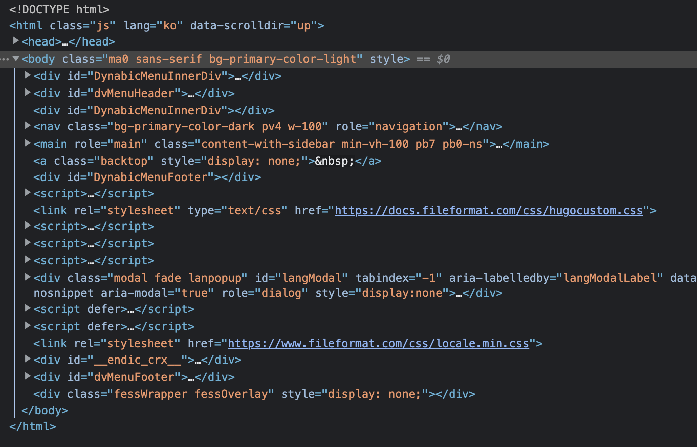
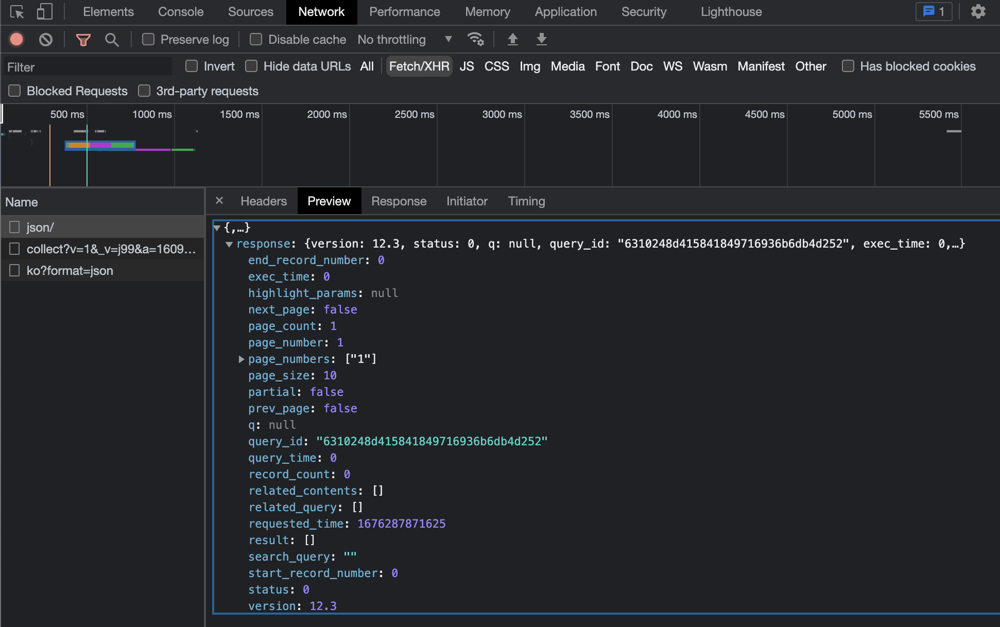

# XML

[XML](https://ko.wikipedia.org/wiki/XML)

[XML 파일 형식](https://docs.fileformat.com/ko/web/xml/)

# HTML

[](https://namu.wiki/w/HTML)



# JSON

[JSON](https://ko.wikipedia.org/wiki/JSON)



# 정적 크롤링

정적인 데이터를 수집

## Requests

HTTP 요청을 보낸다.

[Requests: HTTP for Humans™ - Requests 2.28.2 documentation](https://requests.readthedocs.io/en/latest/)

```python
# requests를 다운받았다는 가정하에 작성합니다.
import requests

# get - 데이터를 요청해 가져온다.
res = requests.get('가져올주소입력')

# post - 데이터를 생성하거나 액션을 한다.
requests.post('요청할주소입력')

# put - 데이터를 수정한다.
requests.put('요청할주소입력')

# delete - 데이터를 삭제한다.
requests.delete('요청할주소입력')
```

## BeautifulSoup

요청받은 웹 페이지의 정보를 쉽게 다룰 수 있게 한다.

[Beautiful Soup Documentation - Beautiful Soup 4.9.0 documentation](https://www.crummy.com/software/BeautifulSoup/bs4/doc/)

```python
from bs4 import BeautifulSoup as bs
import requests

url = "https://www.naver.com/"
res = requests.get(url)
soup = bs(res.text, 'html.parser')

# 태그로 검색하기
print(soup.title)

# string, get_text() - 태그 안에 문자 가져오기
print(soup.title.string)
print(soup.title.get_text())

# find - 요소 하나만 찾기
print(soup.find('p'))

# find_all - 요소 모두 찾기
ps = soup.find_all("p")
for p in ps:
	print(p)

# select - 원하는 옵션으로 찾기
print(soup.select(".name"))
```

### select

원하는 옵션(tag, id, class, attribute, …)으로 찾을 수 있다.

[BeautifulSoup SELECT 정리 및 사용법](https://pythonblog.co.kr/coding/11/)
