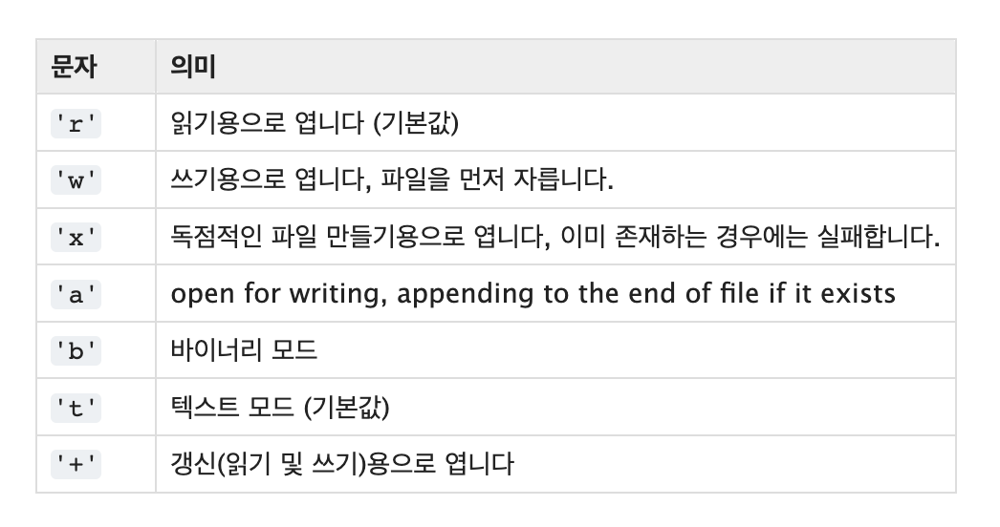
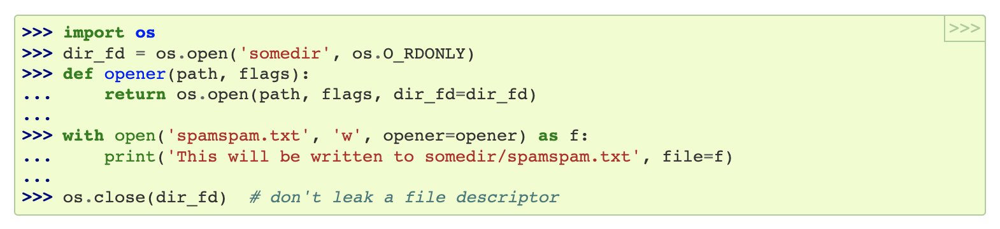

# [Python] 파일 읽기와 쓰기



<br />



<br />

```python
with open('불러올 파일명', '사용 방식', encoding='utf-8') as 지정할 파일명:
    지정한 파일명.read()

# 예시
with open('a.txt', 'r', encoding='utf-8') as n:
    n.read()
```

- 사용 후 문서를 닫아주는 명령이 필요하지만 앞에 `with` 를 사용하면 `코드 블록이 끝나면서 문서도 함께` 자동으로 종료

<br />

#### 📚 참조

- 자세한 내용이 궁금하다면 [클릭](https://docs.python.org/ko/3/library/functions.html#open)
  - 메소드도 함께 보고싶다면 [클릭](https://docs.python.org/ko/3/tutorial/inputoutput.html#tut-files)
