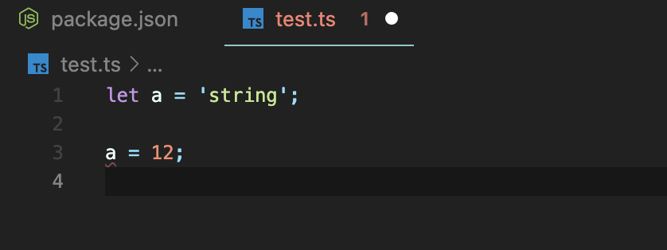
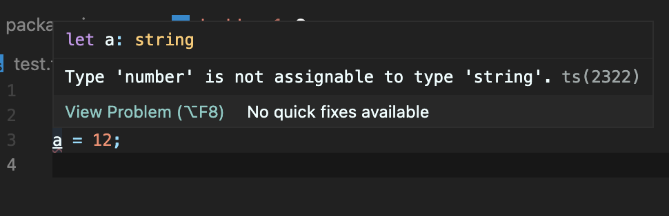

# TypeScript

[JavaScript With Syntax For Types.](https://www.typescriptlang.org/)

# Typed JavaScript at any Scale

- **TypeScript extends JavaScript by adding types.**
  - 타입을 추가한 자바스크립트의 확장판.
- **By understanding JavaScript, TypeScript saves you time catching errors and providing fixes before you run code.**
  - 코드를 실행하기 전에 에러를 잡거나 고치는 일에 허비하는 시간을 줄임.
- **Any browswer, any OS, auywhere JavaScript runs. Entirely Open Source.**
  - 자바스크립트가 실행되는 그 어떤 곳이든 완전한 오픈 소스임.

<br />

# TypeScript = Language

## = Typed Superset of JavaScript = compiles to plain JavaScript

전통적인 컴파일 언어와는 다른 점이 많아서 “Transpile” 이라고도 불린다. 자바스크립트는 “Interpreted Language” 이다.

## Compiled vs Interpreted

|                      | Compiled                        | Interpreted          |
| -------------------- | ------------------------------- | -------------------- |
| 컴파일 필요          | O                               | X                    |
| 컴파일러             | O                               | X                    |
| 컴파일하는 시점      | O                               | X                    |
|                      | = 컴파일된 결과물을 실행        | = 코드 자체를 실행   |
| 코드를 실행하는 시점 | 컴파일된 결과물을 실행하는 시점 | 코드를 실행하는 시점 |
|                      | = 컴파일 타임                   | = 런타임             |

<br />

# Install

```bash
# local
npm i typescript

# global
npm i typescript -g

# dev
npm i typescript -D

# yarn install
yarn global add typescript
```

```bash
# 글로벌에 설치한 경우
tsc

# 로컬에 설치한 경우 node_modules 에서 tsc를 실행해야 한다.
./node_modules/.bin/tsc

# 간단히 사용하려면
npx tsc
```

```bash
# config 파일 생성
npx tsc --init
```

<br />

# Watch mode

_파일에 변화가 있을 때마다 자동으로 컴파일_

```bash
# global
tsc -w

# local
npx tsc -w
```

<br />

# Type Annotation

_무슨 타입을 쓰는지 명시해야 한다._





문자로 선언된 a 에게 숫자를 할당하는 경우에는 에러가 발생한다. 에러가 발생한 빨간줄에 마우스를 올리면 에러메세지를 확인할 수가 있다. `“숫자는 문자에게 할당할 수 없다”`
