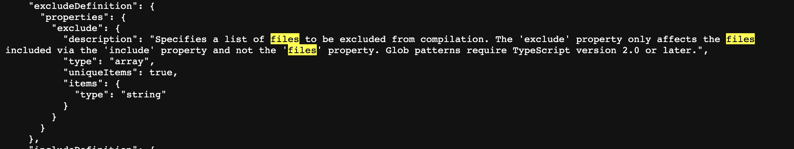

# Compiler

# Compilation Context

[Compilation Context](https://basarat.gitbook.io/typescript/project/compilation-context)

**The compilation context is basically just a fancy term for grouping of the files that TypeScript will parse and analyze to determine what is valid and what isn't.**

컴파일 컨텍스트는 단지 타입스크립트가 무엇이 유효한지 아닌지 판단하기 위해 분석된 파일 그룹화를 위한 화려한 용어일 뿐이다.

**Along with the information about which files, the compilation context contains information about _which compiler options_ are in use.**

컴파일 컨텍스트에는 사용 중인 컴파일러 옵션에 대한 정보가 포함된다.

**A great way to define this logical grouping (we also like to use the term _project_) is using a `tsconfig.json` file.**

이 논리적인 그룹을 정의하는 좋은 방법은 `tsconfig.json` 파일을 사용하는 것이다.

# tsconfig schema

## Top Property

- compileOnSave
- extends
- compileOptions
- files
- include
- exclude
- references

### compileOnSave

- **type**
  - ture or fasle (default false)

### extends

_상속할 파일의 경로를 입력한다._

- **type**
  - string

### files & exclude & include

_파일의 경로를 입력한다. 만약 설정을 하지 않았다면 컴파일러는 모든 파일을 컴파일 하려고 할 것이다._

- **우선순위**
  - files > exclude > include
- **type**
  - array
  - item type: string
- **glob pattens == .gitignore**

## compileOptions

컴파일 시 적용할 _옵션들_

- **@types**
  - 2.0버전부터 사용 가능한 내장 시스템
  - 설정하지 않으면 node_modules/@types 라는 모든 경로를 찾는다.
- **typeRoots**
  - 배열 안에 있는 경로 안에서 찾는다.
- **types**
  - 배열 안에 모듈 혹은 ./node_modules/@types/ 안에 모듈 이름을 찾는다.

### compileOptions - Target

_Which version do you want?_

### compileOptions - lib

_Which type definition library do you want?_

### compileOptions - outFile, outDir, rootDir

- **outFile:** 모든 ts파일을 js 폴더 하나로 컴파일
- **rootDir:** 컴파일할 루트 폴더 지정
- **outDir:** 컴파일 이후 생성되는 js파일의 상위 폴더 지정

### compileOptions - strict

_항상 엄격모드로 코드를 짜야 할 것이다._

- **—noImplicitAny**
  - 표현식이나 선언에 명시적이지 않은 “any” 를 사용할 경우 에러 발생
- **—noImplicitThis**
  - this 표현식에 명시적이지 않은 “any” 를 사용할 경우 에러 발생
- **—strictNullChecks**
  - 모든 타입은 서브 타입으로 null, undefined 값을 가질 수 있다. 이 값을 설정하면 union 을 사용해 직접적으로 명시한 경우에만 사용할 수 있게 된다.
- **—strictFunctionTypes**
  - 반환 타입은 공변적이고, 인자 타입은 반공변적이어야 하는데 타입스크립트에서는 인자 타입이 공변적이면서, 반공변적인 것을 모두 허락한다. 이 부분을 해결해주는 옵션이다.
- **—strictPropertyInitialization**
  - 정의되지 않은 클래스의 속성이 생성자에서 초기화되었는지 확인
- **—strictBindCallApply**
  - bind, call, apply 를 사용할 때 엄격하게 검사하는 옵션
- **—alwaysStrict**
  - 각 소스 파일에 대해 stirct mode 로 코드를 분석한다.
