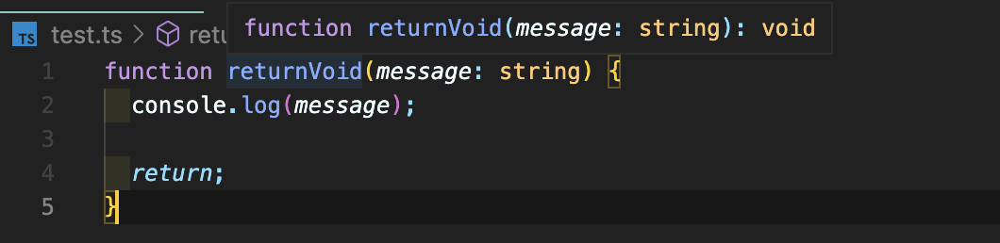

# Data Type

[Documentation - Everyday Types](https://www.typescriptlang.org/docs/handbook/2/everyday-types.html)

[Documentation - Narrowing](https://www.typescriptlang.org/docs/handbook/2/narrowing.html)

<br />

# JavaScript

_자바스크립트 위에 타입이 설정되기 때문에 짚고 넘어가보자._

[Data Type](https://www.notion.so/Data-Type-15e4b92c6967445b802c6cea2c07b338)

<br />

## Primitive Type

_오브젝트와 레퍼런스 형태가 아닌 실제 값을 저장하는 자바스크립트 자료형으로 ES2015 기준으로 6가지가 있다. 모두 `소문자로 작성`해야 한다._

1. boolean
2. number
3. string
4. symbol
5. null
6. undefined

### boolean

```tsx
let isDone: boolean = fasle;

isDone = true;
```

### number

```tsx
let decimal: number = 12;

let NotANumber: number = NaN;

let underscoreNum: number = 1_000_000;
```

### string

```tsx
let name: string = 'name';

name = 'Myname';

// Template String
let fullName: string = `Byeong jin Jo`;

let sentence: string = `Hello, my name is ${fullName}.`;
```

### symbol

```tsx
// 고유한 값인 심볼을 사용한 경우, 접근할 때에도 심볼로만 접근할 수 있다. 문자형으로는 접근할 수 없다.
const sym = Symbol();

const obj = {
  [sym]: 'value',
};

obj[sym];
```

### null & undefined

```tsx
let u: undefined = undefined;

let n: null = null;
```

```tsx
// null과 undefined는 모든 타입의 서브 타입으로 존재할 수 있다.
// 이것을 막으려면 엄격모드인 strict을 지정해야 한다.
let name: string = null;
```

<br />

## Reference

**_non-prinitive type_**

### Object

```tsx
// literal
const person = {
  name: 'name',
  age: 12,
};

// create by Object
// - Union type 으로 object 또는 null을 사용할 수 있다.
const person = Object.create({
  name: 'name',
  age: 12,
});

// Object type
let obj: object = {};
```

### Union type

[Documentation - Everyday Types](https://www.typescriptlang.org/docs/handbook/2/everyday-types.html#union-types)


### Array

_공통 타입들의 모음_

```tsx
let list: number[] = [1, 2, 3];

// union type 을 사용하여 배열 안에 숫자와 문자를 동시에 넣을 수도 있다.
let list: (number | string)[] = [1, 2, 3, '4'];
```

### tuple

_길이가 정해져 있고, 앞뒤의 타입이 다를 수 있음_

```tsx
let x: [string, number];

x = ['hello', 12];

// error!
x[2];
```

### any

_어떤 타입이든 상관없지만 최대한 쓰지 않는 게 핵심_

- _the any will continue to propagate through your objects._
  - **any 는 계속해서 객체를 통해 전파된다.**
- _After all, remember that all the convenience of any comes at the cost of losing type safety._
  - **결국, 모든 편의는 타입의 안전성을 잃는 대가로 온다는 것을 기억해라.**

```tsx
function returnAny(message: any): any {
  console.log(message);
}

const _any = returnAny('리턴은 어떤 타입이든');
```

[안전한 any 타입 만들기](https://overcurried.netlify.app/%EC%95%88%EC%A0%84%ED%95%9C%20any%20%ED%83%80%EC%9E%85%20%EB%A7%8C%EB%93%A4%EA%B8%B0/)

### unknown

_unknown은 컴파일러에게 메세지를 던진다. “어떤 타입이 될진 알 수 없어. 너가 한 번 추론해보지 않을래?”_

```tsx
declare const maybe: unknown;

// 다른 타입으로 선언된 변수에 할당할 수 없다.
const aNumber: number = maybe; // ❌

// 만일 아마도가 참이라면
if (maybe === true) {
  // "아마도는 불린형이구나!"
  const aBoolean: boolean = maybe; // ⭕️

  const aString: string = maybe; // ❌
}

// 만일 아마도의 타입이 문자형이라면
if (typeof maybe === 'string') {
  // "아래 사진 참조"
  maybe;
}
```


### never

_모든 타입에 할당 가능한 서브타입이나, never 에는 본인 외에 어떤 것도 할당할 수 없음_

```tsx
function error(message: string): never {
  throw new Error(message);
}
```

[타입스크립트의 Never 타입 완벽 가이드](https://ui.toast.com/posts/ko_20220323)

### void

_“컴파일러야. 이 함수는 아무것도 반환하지 않을거야.”_

```tsx
function returnVoid(message: string): void {
  console.log(message);

  // undefined를 리턴하게 된다.
  return;
}

returnVoid('리턴이 없음');
```


